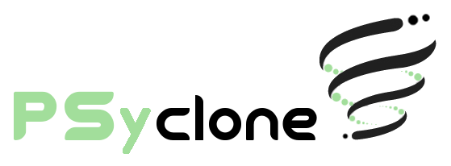

<picture>
  <source media="(prefers-color-scheme: dark)" srcset="doc/logo/psyclone_logo_dark_theme.png">
  <source media="(prefers-color-scheme: light)" srcset="doc/logo/psyclone_logo_light_theme.png">
  
</picture>

PSyclone is a source-to-source Fortran compiler designed to programmatically
optimise, parallelise and instrument HPC applications via user-provided
transformation scripts. By encapsulating the performance-portability aspects
(e.g. whether to parallelise with OpenMP or OpenACC), these scripts enable
a separation of concerns between the scientific implementation and the
optimisation choices. This allows each aspect to be explored and developed
largely independently.
Additionally, PSyclone supports the development of kernel-based Fortran-embedded
DSLs following the PSyKAl model developed in the
[GungHo project](https://www.metoffice.gov.uk/research/foundation/dynamics/next-generation).

PSyclone is currently used to support the [LFRic mixed finite-element PSyKAl
DSL](https://psyclone.readthedocs.io/en/latest/user_guide/lfric.html)
for the [UK MetOffice's next generation modelling
system](https://www.metoffice.gov.uk/research/modelling-systems/lfric/) and
the [GOcean finite-difference PSyKAl
DSL](https://psyclone.readthedocs.io/en/latest/user_guide/gocean1p0.html) for a [prototype
2D ocean modelling system](https://gtr.ukri.org/projects?ref=NE%2FL01209X%2F1).
It is also used to [insert GPU offloading
directives](https://psyclone.readthedocs.io/en/latest/tutorials_and_examples/nemo_examples.html) into existing
directly-addressed MPI applications such as the
[NEMO ocean model](https://www.nemo-ocean.eu/).

For more detailed information see the [PSyclone Documentation](http://psyclone.readthedocs.io/en/latest).

# Installation #

You can install the latest release of psyclone from PyPI by using:

    $ pip install psyclone

or, if you want an isolated installation in a [python virtual
environment](https://docs.python.org/3/library/venv.html):

    $ python -m venv <virtual_env_name>
    $ source <virtual_env_name>/bin/activate
    $ pip install psyclone

Alternatively, you can install the latest upstream version of psyclone by
cloning this repository and using:

    $ pip install .

or in developer (editable) mode using

    $ pip install -e .

PSyclone is also available in the
[Conda](https://anaconda.org/conda-forge/psyclone) and
[Spack](https://packages.spack.io/package.html?name=py-psyclone) package
managers.

For more information about the installation process see the
[Getting Going](https://psyclone.readthedocs.io/en/latest/user_guide/getting_going.html).
section of the User Guide.

<!---  TODO #2627
# Try it on Binder #

Some of the examples are available as Jupyter notebooks. These may
be launched using Binder from the links below. (Note that the first time
this is done, Binder has to construct a Container and install the necessary
software. This can take several minutes. You can track its progress
by clicking the 'show' link next to the 'Build logs' heading.)

 *  The **PSyclone Tutorial**. Note that we currently recommend following the more up-to-date README files under the `tutorials/practicals` directory.

 *  Uses PSyclone's GOcean API to process example code that conforms to the PSyKAl separation of concerns. Transformations are applied in order to fuse various loops before parallelising the result with OpenMP.
 
 *  demonstrates the generation of a DAG for the PSy layer of the previous example.
--->

# Structure #

Path                | Description
------------------- | -----------
bin/                | Top-level driver scripts for PSyclone and the PSyclone kernel tool
changelog      	    | Information on changes between releases
doc/           	    | Documentation source using Sphinx
examples/      	    | Simple examples
README.md      	    | This file
src/psyclone   	    | The Python source code
src/psyclone/tests/ | Unit and functional tests using pytest
tutorial/practicals | Hands-on exercises using a local installation of PSyclone
