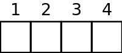
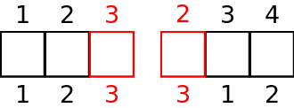
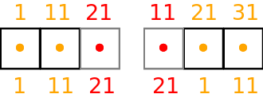
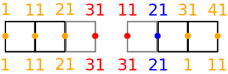
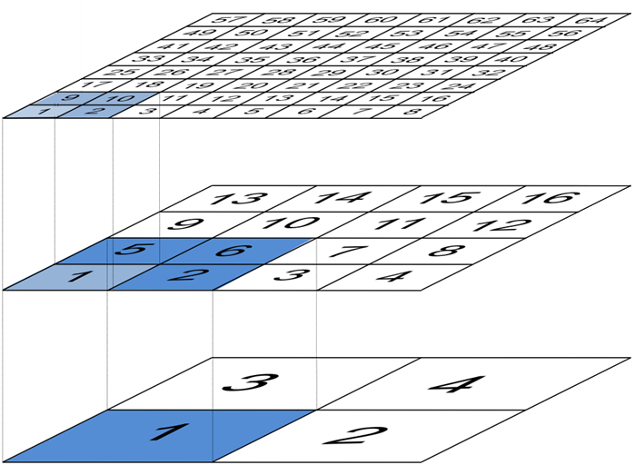
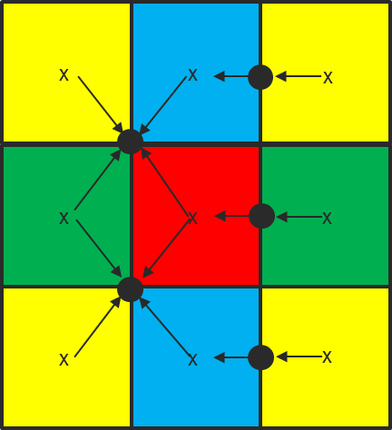

.. -----------------------------------------------------------------------------
.. BSD 3-Clause License
..
.. Copyright (c) 2019, Science and Technology Facilities Council.
.. All rights reserved.
..
.. Redistribution and use in source and binary forms, with or without
.. modification, are permitted provided that the following conditions are met:
..
.. * Redistributions of source code must retain the above copyright notice, this
..   list of conditions and the following disclaimer.
..
.. * Redistributions in binary form must reproduce the above copyright notice,
..   this list of conditions and the following disclaimer in the documentation
..   and/or other materials provided with the distribution.
..
.. * Neither the name of the copyright holder nor the names of its
..   contributors may be used to endorse or promote products derived from
..   this software without specific prior written permission.
..
.. THIS SOFTWARE IS PROVIDED BY THE COPYRIGHT HOLDERS AND CONTRIBUTORS
.. "AS IS" AND ANY EXPRESS OR IMPLIED WARRANTIES, INCLUDING, BUT NOT
.. LIMITED TO, THE IMPLIED WARRANTIES OF MERCHANTABILITY AND FITNESS
.. FOR A PARTICULAR PURPOSE ARE DISCLAIMED. IN NO EVENT SHALL THE
.. COPYRIGHT HOLDER OR CONTRIBUTORS BE LIABLE FOR ANY DIRECT, INDIRECT,
.. INCIDENTAL, SPECIAL, EXEMPLARY, OR CONSEQUENTIAL DAMAGES (INCLUDING,
.. BUT NOT LIMITED TO, PROCUREMENT OF SUBSTITUTE GOODS OR SERVICES;
.. LOSS OF USE, DATA, OR PROFITS; OR BUSINESS INTERRUPTION) HOWEVER
.. CAUSED AND ON ANY THEORY OF LIABILITY, WHETHER IN CONTRACT, STRICT
.. LIABILITY, OR TORT (INCLUDING NEGLIGENCE OR OTHERWISE) ARISING IN
.. ANY WAY OUT OF THE USE OF THIS SOFTWARE, EVEN IF ADVISED OF THE
.. POSSIBILITY OF SUCH DAMAGE.
.. -----------------------------------------------------------------------------
.. Written by R. W. Ford and A. R. Porter, STFC Daresbury Lab

Generic Code
############

PSyclone is designed to be configurable so that new front-ends (called
APIs) can be built, re-using as much existing code as possible. The
generic code is kept in the `psyGen.py` file for psy-code generation.

New APIs
########

TBD

.. Generating API-specific code
.. ============================
.. 
.. This section explains how to create a new API in PSyclone. PSyclone
.. currently supports the following APIs; dynamo versions 0.1 and 0.3
.. and gocean versions 0.1 and 1.0.
.. 
.. config.py
.. ---------
.. 
.. The names of the supported APIs and the default API are specified in
.. `configuration.py`. When adding a new API you must add the name you would like
.. to use to the ``_supported_api_list`` (and change the ``_default_api`` if
.. required).
.. 
.. parse.py
.. --------
.. 
.. The parser reads the algorithm code and associated kernel metadata.
.. 
.. The parser currently assumes that all APIs will use the `invoke()`
.. API for the algorithm-to-psy layer but that the content and structure
.. of the metadata in the kernel code may differ. If the algorithm API
.. differs, then the parser will need to be refactored. This is beyond
.. the scope of this document and is currently not considered in the
.. PSyclone software architecture.
.. 
.. The kernel metadata however, will be different from one API to
.. another. To parse this kernel-API-specific metadata a
.. `KernelTypeFactory` is provided which should return the appropriate
.. `KernelType` object. When adding a new API a new API-specific subclass
.. of `KernelType` should be created and added to the `create()` method
.. in the `KernelTypeFactory` class. If the kernel metadata happens to be
.. the same as another existing API then the existing `KernelType`
.. subclass can be used for the new API.
.. 
.. The `KernelType` subclass needs to specialise the class constructor
.. and initialise the `KernelType` base class with the
.. supplied arguments. The role of the `KernelType` subclass is to create
.. a kernel-metadata-specific subclass of the `Descriptor` class and
.. populate this with the relevant API-specific metadata. After doing
.. this is appends the kernel-metadata-specific subclass instance is
.. appended to the `_arg_descriptors` list provided by the `KernelType`
.. base class.
.. 
.. TBC
.. 
.. This information
.. 
.. KernelType base class assumes kernel metadata stored as a type. Searches for that type.
.. Checks whether the metadata is public (it should be ?)
.. Assumes iterates_over variable.
.. Binding to a procedure - assumes one of two styles.
.. Assumes a meta_args type
.. *What about our func_args type???*
.. 
.. type x
.. meta_args=
.. *meta_func=*
.. iterates_over=
.. code => or code =
.. end type x
.. 
.. The descriptor class ...
.. 
.. psyGen.py
.. ---------
.. 
.. factory
.. +++++++
.. 
.. A new file needs to be created and the following classes found in
.. psyGen.py need to be subclassed.
.. 
.. PSy, Invokes, Invoke, InvokeSchedule, Loop, Kern, Arguments, Argument
.. You may also choose to subclass the Inf class if required.
.. 
.. The subclass of the PSy class then needs to be added as an option to
.. the create method in the PSyFactory class.
.. 
.. Initialisation
.. ++++++++++++++
.. 
.. The parser information passed to the PSy layer is used to create an
.. invokes object which in turn creates a list of invoke objects. Each
.. invoke object contains an InvokeSchedule which consists of loops and
.. calls. Finally, a call contains an arguments object which itself
.. contains a list of argument objects.
.. 
.. To make sure the subclass versions of the above objects are created
.. the __init__ methods of the subclasses must make sure they create
.. the appropriate objects.
.. 
.. Some of the baseclass constructors (__init__ methods) support the
.. classname being provided. This allow them to instantiate the
.. appropriate objects without knowing what they are.
.. 
.. gen_code()
.. ++++++++++
.. 
.. All of the above classes (with the exception of PSy which supports a
.. gen() method) have the gen_code() method. This method passes the
.. parent of the generation tree and expect the object to add the code
.. associated with the object as a child of the parent. The object is
.. then expected to call any children. This approach is powerful as it
.. lets each object concentrate on the code that it is responsible for.
.. 
.. Adding code in gen_code()
.. +++++++++++++++++++++++++
.. 
.. The f2pygen classes have been developed to help create appropriate
.. fortran code in the gen_code() method.
.. 
.. When writing a gen_code() method for a particular object and API it is
.. natural to add code as a child of the parent provided by the callee of
.. the method. However, in some cases we do not want code to appear at
.. the current position in the hierarchy.
.. 
.. The add() method
.. ++++++++++++++++
.. 
.. PSyclone supports this via the add() method
.. 
.. explicitly place at the appropriate place in the hierarchy. For example,
.. parent.parent.add(...)
.. 
.. optional argument. default is auto. This attempts to place code in the
.. expected place. For example, specify a declaration. auto finds a
.. correct place to put this code.
.. 
.. Specify position explicitly
.. "before", "after", "first", "last"
.. 
.. Sometimes don't know exactly where to place. On example that is
.. supported is when you want to add something before or after a loop
.. nest. start_parent_loop(). This method recurses up until the parent is
.. not a loop, it then skips any comments (as they may be directives) and
.. return this position. Therefore supports an arbitrary number of loops
.. and directives.

Existing APIs
#############

.. _dynamo0.3-developers:

Dynamo0.3
=========

Mesh
----

The Dynamo0.3 API supports meshes that are unstructured in the
horizontal and structured in the vertical. This is often thought of as
a horizontal 2D unstructured mesh which is extruded into the
vertical. The LFRic infrastructure represents this mesh as a list of
2D cells with a scalar value capturing the number of levels in the
vertical "column".

Cells
-----

The Dynamo0.3 API currently assumes that all kernels which support
iterating over cells work internally on a column of cells. This means
that PSyclone need only be concerned with iterating over cell-columns
in the horizontal. As a result the LFRic infrastructure presents the
mesh information to PSyclone as if the mesh were 2-dimensional. From
now on this 2D view will be assumed i.e. a cell will actually be a
column of cells. The LFRic infrastracture provides a global 2D cell
index from 1 to the number of cells.

For example, a simple quadrilateral element mesh with 4 cells might be
indexed in the following way.

When the distributed memory option is switched on in the Dynamo0.3 API
(see the :ref:`distributed_memory` Section) the cells in the model are
partitioned amongst processors and halo cells are added at the
boundaries to a depth determined by the LFRic infrastructure. In this
case the LFRic infrastructure maintains the global cell index and
adds a unique local cell index from 1 to the number of cells in each
partition, including any halo cells.

An example for a depth-1 halo implementation with the earlier mesh
split into 2 partitions is given below, with the halo cells being
coloured red. An example local indexing scheme is also provided below
the cells. Notice the local indexing scheme is set up such that owned
cells have lower indices than halo cells.

Dofs
----

In the LFRic infrastracture the degrees-of-freedom (dofs) are indexed
from 1 to the total number of dofs. The infrastructure also indexes
dofs so that the values in a column are contiguous and their values
increase in the vertical. Thus, given the dof indices for the "bottom"
cell, the rest of the dof indices can be determined for the
column. This set of dof indices for the bottom cell is called a
dofmap.

Dofs represent a field's values at various locations in the
mesh. Fields can either be continuous or discontinuous. Continuous
fields are so named because their values are continuous across cell
boundaries. Dofs that represent continuous fields are shared between
neighbouring cells. Discontinuous fields have values that are not
necessarily related between neighbouring cells (there can be
discontinuities across cell boundaries). Dofs that represent
discontinuous fields are local to a cell.

Discontinuous Dofs
------------------

A simple example of discontinuous dofs is given below. In this case
each cell contains 1 dof and there are 10 cells in a column. We only
show the bottom cells and their corresponding dof indices. As
explained earlier, the dof indices increase contiguously up the
column, so the cell above the cell containing dof index 1 contains dof
index 2 and the cell above that contains dof index 3 etc.

.. image:: dofs_disc_global.png
	   :width: 120

As discussed in the previous section, when the distributed memory
option is switched on in the Dynamo0.3 API (see the
:ref:`distributed_memory` Section) the cells in the model are
partitioned amongst processors and halo cells are added at the
boundaries to a depth determined by the LFRic infrastructure. This
results in the dofs being replicated in the halo cells, leading to a
dof halo. As for cells, the LFRic infrastructure maintains the global
dof indexing scheme and adds a local dof indexing scheme from 1 to the
number of dofs in each partition, including any halo dofs.

An example for a depth-1 halo implementation with the earlier mesh
split into 2 partitions is given below, with the halo cells drawn in
grey and halo dofs coloured red. An example local partition indexing
scheme is also provided below the dofs. As with cells, notice the
local indexing scheme ensures that owned dofs have lower indices than
halo dofs.

Continuous Dofs
---------------

A simple continuous dof example is given below for the same mesh as
before. In this case dofs are on cell edges in the horizontal and
there are 10 cells in a column. Again we only show the bottom cells
and their corresponding dof indices. As explained earlier, the dof
indices increase contiguously up the column, so the cell above the
cell containing dof index 1 contains dof index 2 and the cell above
that contains dof index 3 etc.

.. image:: dofs_cont_global.png
	   :width: 140

As already explained, when the distributed memory option is switched
on in the Dynamo0.3 API (see the :ref:`distributed_memory` Section)
the cells in the model are partitioned amongst processors and halo
cells are added at the boundaries.

In the example below we ignore the additional halo cells and just look
at the partitioning of cells amongst processors (with the same mesh
and 2 partitions as shown earlier). It can be seen that the dofs
shared between cells which are on different partitions now need to be
replicated if fields on continuous dofs are going to be able to be
computed locally on each partition. This concept is different to halos
as there are no halo cells here, the fact that the cells are
partitioned has meant that continuous dofs on the edge of the
partition are replicated. The convention used in Dynamo0.3 is that the
cell with the lowest global id determines which partition owns a
dof and which has the copy. Dofs which are copies are called
`annexed`. Annexed dofs are coloured blue in the example:

.. image:: dofs_cont_annexed.png
	   :width: 160

If we now extend the above example to include the halo cells (coloured
grey) then we get:

		   
An example for a depth-1 halo implementation with the earlier mesh
split into 2 partitions is given below, with the halo cells drawn in
grey and halo dofs coloured red. An example local indexing scheme is
also provided below the dofs. Notice the local indexing scheme ensures
that owned dofs have lower indices than annexed dofs, which in turn
have lower indices than halo dofs.

Cell and Dof Ordering
---------------------

Cells in a partition are sequentially indexed by the LFRic
infrastructure, starting at 1, so that local cells occur first, then
level-1 halo cells, then level-2 halo cells etc. A benefit of this
layout is that it makes it easy for PSyclone to specify the required
iteration space for cells as a single range, allowing a single Fortran
do loop (or other language construct as required) to be generated. The
LFRic infrastructure provides an API that returns the index of the
last owned cell, the index of the last halo cell at a particular depth
and the index of the last halo cell, to support PSyclone code
generation.

Dofs on a partition are also sequentially indexed by the LFRic
infrastructure, starting at 1, so that local dofs occur first, then
annexed dofs (if the field is continuous), then level-1 halo dofs,
then level-2 halo dofs etc. Again, this layout makes it easy for
PSyclone to specify the required iteration space for dofs as a single
range. As before, the LFRic infrastructure provides an API that
returns the index of the last owned dof, the index of the last annexed
dof, the index of the last halo dof at a particular depth and the
index of the last halo dof, to support PSyclone code generation.

.. _multigrid:

Multi-grid
----------

The Dynamo 0.3 API supports kernels that map fields between meshes of
different horizontal resolutions; these are termed "inter-grid"
kernels. As indicated in :numref:`fig-multigrid` below, the change in
resolution between each level is always a factor of two in both the
``x`` and ``y`` dimensions.

.. _fig-multigrid:

	   The arrangement of cells in the multi-grid hierarchy used
	   by LFRic. (Courtesy of R. Wong, Met Office.)

Inter-grid kernels are only permitted to deal with fields on two,
neighbouring levels of the mesh hierarchy. In the context of a single
inter-grid kernel we term the coarser of these meshes the "coarse"
mesh and the other the "fine" mesh.

There are two types of inter-grid operation; the first is
"prolongation" where a field on a coarse mesh is mapped onto a fine
mesh. The second is "restriction" where a field on a fine mesh is
mapped onto a coarse mesh.  Given the factor of two difference in
resolution between the fine and coarse meshes, the depth of any halo
accesses for the field on the fine mesh must automatically be double
that of those on the coarse mesh.

Loop iterators
--------------

In the current implementation of the Dynamo0.3 API it is possible to
iterate (loop) either over cells or dofs. At the moment all coded
kernels are written to iterate over cells and all builtin kernels are
written to iterate over dofs, but that does not have to be the case.

The loop iteration information is specified in the kernel metadata. In
the case of builtin's there is kernel metadata but it is part of
PSyclone and is specified in
`src/psyclone/dynamo0p3_builtins_mod.f90`.

For inter-grid kernels, it is the coarse mesh that provides the iteration
space. (The kernel is passed a list of the cells in the fine mesh that are
associated with the current coarse cell.)

Cell iterators: Continuous
--------------------------

When a kernel is written to iterate over cells and modify a continuous
field, PSyclone always computes dofs on owned cells and redundantly
computes dofs in the level-1 halo (or to depth 2 if the field is on
the fine mesh of an inter-grid kernel - see :ref:`multigrid`). Users
can apply a redundant computation transformation to increase the halo
depth for additional redundant computation but it must always at least
compute the level-1 halo. The reason for this is to ensure that the
shared dofs on cells on the edge of the partition (both owned and
annexed) are always correctly computed. Note that the outermost halo
dofs are not correctly computed and therefore the outermost halo of
the modified field is dirty after redundant computation. Also note
that if we do not know whether a modified field is discontinuous or
continuous then we must assume it is continuous.

An alternative solution could have been adopted in Dynamo0.3 whereby
no redundant computation is performed and partial-sum results are
shared between processors in a communication pattern similar to halo
exchanges. However, a decision was made to always perform redundant
computation.

A downside of performing redundant computation in the level-1 halo is
that any fields being read by the kernel must have their level-1 halo
clean (up-to-date), which can result in halo exchanges. Note that this
is not the case for the modified field, it does not need its halo to
be clean.

Cell iterators: Discontinuous
-----------------------------

When a kernel is written to iterate over cells and modify a
discontinuous field, PSyclone only needs to compute dofs on owned
cells. Users can apply a redundant computation transformation to
redundantly compute into the halo but this is not done by default.

.. _annexed_dofs:

Dof iterators
-------------

When a kernel that is written to iterate over dofs modifies a field,
PSyclone must ensure that all dofs in that field are updated. If the
distributed memory flag is set to ``false`` then PSyclone must iterate
over all dofs. PSyclone simply needs to create a loop that iterates
from 1 to the total number of dofs. The latter value is provided by
the LFRic API.

If the distributed memory flag is set to ``true`` then PSyclone must
ensure that each partition only iterates over owned dofs. Again PSyclone
just needs to create a loop that iterates from 1 to the total number
of owned dofs on that partition. The latter value is provided by the
LFRic API.

When the distributed memory flag is set to ``true`` an aditional
configuration option can be set which makes PSyclone always create
loops which iterate over both owned and annexed dofs. Whilst this is
not necessary for correctness, it can improve performance by reducing
the number of halo exchanges required (at the expense of computing
annexed dofs redundantly). The only change for PSyclone is that it
calls a different LFRic routine which returns the index of the last
annexed dof. This iteration space will necessarily also include all
owned dofs due to the ordering of dof indices discussed earlier.

The configuration variable is called `COMPUTE_ANNEXED_DOFS` and is
found in the `dynamo0.3` section of the `psyclone.cfg`
configuration file (see :ref:`configuration`). If it is ``true`` then
annexed dofs are always computed in loops that iterate over dofs and
if it is ``false`` then annexed dofs are not computed. The default in
PSyclone is ``false``.

The computation of annexed dofs could have been added as a
transformation optimisation. The reason for using a configuration
switch is that it is then guaranteed that annexed dofs are always
computed for loops that iterate over dofs which then allows us to
always remove certain halo exchanges without needing to add any new
ones.

If we first take the situation where annexed dofs are not computed for
loops that iterate over dofs i.e. (`COMPUTE_ANNEXED_DOFS` is ``false``),
then a field's annexed dofs will be dirty (out-of-date) after the loop
has completed. If a following kernel needs to read the field's
annexed dofs, then PSyclone will need to add a halo exchange to make
them clean.

There are 4 cases to consider:

1) the field is read in a loop that iterates over dofs,
2) the field is read in a loop that iterates over owned cells and
   level-1 halo cells,
3) the field is incremented in a loop that iterates over owned cells and
   level-1 halo cells, and
4) the field is read in a loop that iterates over owned cells

In case 1) the annexed dofs will not be read as the loop only iterates
over owned dofs so a halo exchange is not required. In case 2) the
full level-1 halo will be read (including annexed dofs) so a halo
exchange is required. In case 3) the annexed dofs will be updated so a
halo exchange is required. In case 4) the annexed dofs will be read so
a halo exchange will be required.

If we now take the case where annexed dofs are computed for loops that
iterate over dofs (`COMPUTE_ANNEXED_DOFS` is ``true``) then a field's
annexed dofs will be clean after the loop has completed. If a
following kernel needs to read the field's annexed dofs, then
PSyclone will no longer need a halo exchange.

We can now guarantee that annexed dofs will always be clean after a
continuous field has been modified by a kernel. This is because loops
that iterate over either dofs or cells now compute annexed dofs and
there are no other ways for a continuous field to be updated.

We now consider the same four cases. In case 1) the annexed dofs will
now be read, but annexed dofs are guaranteed to be clean, so no halo
exchange is required. In case 2) the full level-1 halo is read so a
halo exchange is still required. Note, as part of this halo exchange
we will update annexed dofs that are already clean. In case 3) the
annexed dofs will be updated but a halo exchange is not required as
the annexed dofs are guaranteed to be clean. In case 4) the annexed
dofs will be read but a halo exchange is not required as the annexed
dofs are guaranteed to be clean.

Furthermore, in the 3rd and 4th cases (in which annexed dofs are read
or updated but the rest of the halo does not have to be clean), where
the previous writer is unknown (as it comes from a different invoke
call) we need to add a speculative halo exchange (one that makes use of
the runtime clean and dirty flags) when `COMPUTE_ANNEXED_DOFS` is
`False`, as the previous writer *may* have iterated over dofs, leaving
the annexed dofs dirty. In contrast, when `COMPUTE_ANNEXED_DOFS` is
`True`, we do not require a speculative halo exchange as we know that
annexed dofs are always clean.

Therefore no additional halo exchanges are required when
`COMPUTE_ANNEXED_DOFS` is changed from ``false`` to ``true`` i.e. case 1)
does not require a halo exchange in either situation and case 2)
requires a halo exchange in both situations. We also remove halo
exchanges for cases 3) and 4) so the number of halo exchanges may be
reduced.

If a switch were not used and it were possible to use a transformation
to selectively perform computation over annexed dofs for loops that
iterate over dofs, then we would no longer be able to guarantee that
annexed dofs would always be clean. In this situation, if the dofs
were known to be dirty then PSyclone would need to add a halo exchange
and if it were unknown whether the dofs were dirty or not, then a halo
exchange would need to be added that uses the run-time flags to
determine whether a halo exchange is required. As run-time flags are
based on whether the halo is dirty or not (not annexed dofs) then a
halo exchange would be performed if the halo were dirty, even if the
annexed dofs were clean, potentially resulting in more halo exchanges
than are necessary.

Halo Exchange Logic
-------------------

Halo exchanges are required when the `DISTRIBUTED_MEMORY` flag is set to
``true`` in order to make sure any accesses to a field's halo or to its
annexed dofs receive the correct value.

Operators and Halo Exchanges
++++++++++++++++++++++++++++

Halo Exchanges are only created for fields. This causes an issue for
operators. If a loop iterates over halos to a given depth and the loop
includes a kernel that reads from an operator then the operator must
have valid values in the halos to that depth. In the current
implementation of PSyclone all loops which write to, or update an
operator are computed redundantly in the halo up to depth-1 (see the
`load()` method in the `DynLoop` class). This implementation therefore
requires a check that any loop which includes a kernel that reads from
an operator is limited to iterating in the halo up to
depth-1. PSyclone will raise an exception if an optimisation attempts
to increase the iteration space beyond this (see the `gen_code()`
method in the `DynKern` class).

To alleviate the above restriction one could add a configurable depth with
which to compute operators e.g. operators are always computed up to
depth-2, or perhaps up to the maximum halo depth. An alternative would
be to halo exchange operators as required in the same way that halo
exchanges are used for fields.

First Creation
++++++++++++++

When first run, PSyclone creates a separate InvokeSchedule for each of the
invokes found in the algorithm layer. This schedule includes all required
loops and kernel calls that need to be generated in the PSy layer for
the particular invoke call. Once the loops and kernel calls have been
created then (if the `DISTRIBUTED_MEMORY` flag is set to ``true``) PSyclone
adds any required halo exchanges and global sums. This work is all
performed in the `DynInvoke` constructor (`__init__`) method.

In PSyclone we apply a lazy halo exchange approach (as opposed to an
eager one), adding a halo exchange just before it is required.

It is simple to determine where halo exchanges should be added for the
initial schedule. There are three cases:

1) loops that iterate over cells and modify a continuous field will
   access the level-1 halo. This means that any field that is read
   within such a loop must have its level-1 halo clean (up-to-date)
   and therefore requires a halo exchange. A modified field (specified
   as `GH_INC` which involves a read before a write) will require a
   halo exchange if its annexed dofs are not clean, or if their
   status is unknown. Whilst it is only the annexed dofs that need to
   be made clean in this case, the only way to acheive this is
   via a halo exchange (which updates the halo i.e. more than is
   required). Note, if the `COMPUTE_ANNEXED_DOFS` configuration
   variable is set to ``true`` then no halo exchange is required as
   annexed dofs will always be clean.

2) continuous fields that are read from within loops that iterate over
   cells and modify a discontinuous field will access their annexed
   dofs. If the annexed dofs are known to be dirty (because the
   previous modification of the field is known to be from within a
   loop over dofs) or their status is unknown (because the previous
   modification to the field is outside of the current invoke) then a
   halo exchange will be required (As already mentioned, currently the
   only way to make annexed dofs clean is to perform a halo
   swap. Note, if the `COMPUTE_ANNEXED_DOFS` configuration variable is
   set to ``true`` then no halo exchange is required as annexed dofs
   will always be clean.

3) fields that have a stencil access will access the halo and need
   halo exchange calls added.

Halo exchanges are created separately (for fields with halo reads) for
each loop by calling the `create_halo_exchanges()` method within the
`DynLoop` class.

In the situation where a field's halo is read in more than one kernel
in different loops, we do not want to add too many halo exchanges -
one will be enough as long as it is placed correctly. To avoid this
problem we add halo exchange calls for loops in the order in which
they occur in the schedule. A halo exchange will be added before the
first loop for a field but the same field in the second loop will find
that there is a dependence on the previously inserted halo exchange so
no additional halo exchange will be added.

The algorithm for adding the necessary halo exchanges is as follows:
For each loop in the schedule, the `create_halo_exchanges()` method
iterates over each field that reads from its halo (determined by the
`unique_fields_with_halo_reads()` method in the `DynLoop` class).

For each field we then look for its previous dependencies (the
previous writer(s) to that field) using PSyclone's dependence
analysis. Three cases can occur: 1) there is no dependence, 2) there
are multiple dependencies and 3) there is one dependence.

1) If no previous dependence is found then we add a halo exchange call
   before the loop (using the internal helper method
   `_add_halo_exchange()`). If the field is a vector field then a halo
   exchange is added for each component. The internal helper method
   `_add_halo_exchange` itself uses the internal helper method
   `_add_halo_exchange_code()`. This method creates an instance of the
   `DynHaloExchange` class for the field in question and adds it to
   the schedule before the loop. You might notice that this method
   then checks that the halo exchange is actually required and removes
   it again if not. In our current situation the halo exchange will
   always be needed so this check is not required but in more complex
   situations after transformations have been applied to the schedule
   this may not be the case. We discuss this type of situation later.

2) If multiple previous dependencies are found then the field must be
   a vector field as this is the only case where this can occur. We
   then choose the closest one and treat it as a single previous
   dependency (see 3).

3) If a single previous dependency is found and it is a halo exchange
   then we do nothing, as it is already covered. This will only happen
   when more than one reader depends on a writer, as discussed
   earlier. If the dependence is not a halo exchange then we add one.

After completing the above we have all the halo exchanges required for
correct execution.

Note that we do not need to worry about halo depth or whether a halo
is definitely required, or whether it might be required, as this is
determined by the halo exchange itself at code generation time. The
reason for deferring this information is that it can change as
transformations are applied.

Asynchronous Halo Exchanges
+++++++++++++++++++++++++++

The Dynamo0p3AsynchronousHaloExchange transformation allows the
default synchronous halo exchange to be split into a halo exchange
start and a halo exhange end which are represented separately as nodes
in the schedule. These can then be moved in the schedule to allow
overlapping of communication and computation, as long as data
dependencies are honoured.

A halo exchange both reads and modifies a field so has a readwrite
access for dependence analysis purposes. An asynchronous halo exchange
start reads the field and an asynchronous halo exchange end writes to
the field. Therefore the obvious thing to do would be to have the
associated field set to read and write access respectively. However,
the way the halo exchange logic works means that it is simplest to set
the halo exchange end access to readwrite. The reason for this is that
the logic to determine whether a halo exchange is required
(`_required()`) needs information from all fields that read from the
halo after the halo exchange has been called (and therefore must be
treated as a write with following reads for dependence analysis) and
it needs information from all fields that write to the field before
the halo exchange has been called (and therefore must be treated as a
read with previous writes for dependence analysis). An alternative
would be to make the `_required()` method use the halo exchange start
for previous writes and the halo exchange end for following
reads. However, it was decided that this would be more complicated
than the solution chosen.

Both halo exchange start and halo exchange end inherit from halo
exchange. However, the halo exchange start and end are really two
parts of the same thing and need to have consistent properties
including after transformations have been performed. This is achieved by
having the halo exchange start find and use the methods from the halo
exchange end, rather than implement them independently. The actual
methods needed are `_compute_stencil_type()`,
`_compute_halo_depth()` and `_required()`. It is unclear how much
halo exhange start really benefits from inheriting from halo exchange
and this could probably be removed at the expense of returning
appropriate names for the dag, colourmap, declaration etc.

.. note:: The dependence analysis for halo exchanges for field vectors
   is currently over zealous. It does not allow halo exchanges for
   independent vector components to be moved past one another. For
   example, a halo exchange for vector component 2, if placed after a halo
   exchange for component 1 could not be moved before the halo exchange
   for component 1, even though the accesses are independent of each
   other. This is also the case for asynchronous halo exchanges. See
   issue #220.

Evaluators
----------

Evaluators consist of basis and/or differential basis functions for a
given function space, evaluated at the nodes of another, 'target',
function space. A kernel can request evaluators on multiple target
spaces through the use of the `gh_evaluator_targets` metadata entry.
Every evaluator used by that kernel will then be provided on all of the
target spaces.

When constructing a `DynKernMetadata` object from the parsed kernel
metadata, the list of target function-space names (as they appear in
the meta-data) is stored in `DynKernMetadata._eval_targets`. This
information is then used in the `DynKern._setup()` method which
populates `DynKern._eval_targets`. This is an `OrderedDict` which has
the (mangled) names of the target function spaces as keys and 2-tuples
consisting of `FunctionSpace` and `DynKernelArgument` objects as
values. The `DynKernelArgument` object provides the kernel argument
from which to extract the function space and the `FunctionSpace` object
holds full information on the target function space.

The `DynInvokeBasisFunctions` class is responsible for managing the
evaluators required by all of the kernels called from an Invoke.
`DynInvokeBasisFunctions._eval_targets` collects all of the unique target
function spaces from the `DynKern._eval_targets` of each kernel.

`DynInvokeBasisFunctions._basis_fns` is a list holding information on
each basis/differential basis function required by a kernel within the
invoke. Each entry in this list is a `dict` with keys:

============= =================================== ===================
Key           Entry                      	  Type
============= =================================== ===================
shape         Shape of the evaluator              `str`
type          Whether basis or differential basis `str`
fspace        Function space             	  `FunctionSpace`
arg           Associated kernel argument 	  `DynKernelArgument`
qr_var        Quadrature argument name   	  `str`
nodal_fspaces Target function spaces     	  list of `(FunctionSpace, DynKernelArgument)`
============= =================================== ===================

Modifying the Schedule
----------------------

Transformations modify the schedule. At the moment only one of these
transformations - the `Dynamo0p3RedundantComputationTrans` class in
`transformations.py` - affects halo exchanges. This transformation can
mean there is a requirement for new halo exchanges, it can mean
existing halo exchanges are no longer required and it can mean that
the properties of a halo exchange (e.g. depth) can change.

The redundant computation transformation is applied to a loop in a
schedule. When this is done the `update_halo_exchanges()` method for
that loop is called - see the `apply()` method in
`Dynamo0p3RedundantComputationTrans`.

The first thing that the `update_halo_exchanges()` method does is call
the `create_halo_exchanges()` method to add in any new halo exchanges
that are required before this loop, due to any fields that now have a
read access to their halo when they previously did not. For example, a
loop containing a kernel that writes to a certain field might
previously have iterated up to the number of owned cells in a
partition (`ncells`) but now iterates up to halo depth 1.

However, a field that has its halo read no longer guarantees that a
halo exchange is required, as the previous dependence may now compute
redundantly to halo depth 2, for example. The solution employed in
`create_halo_exchanges()` is to add a halo exchange speculatively and
then remove it if it is not required. The halo exchange itself
determines whether it is required or not via the `required()` method. The
removal code is found at the end of the `_add_halo_exchange_code()`
method in the `DynLoop()` class.

The second thing that the `update_halo_exchanges()` method does is check
that any halo exchanges after this loop are still required. It finds
all relevant halo exchanges, asks them if they are required and if
they are not it removes them.

We only need to consider adding halo exchanges before the loop and
removing halo exchanges after the loop. This is because redundant
computation can only increase the depth of halo to which a loop
computes so can not remove existing halo exchanges before a loop (as
an increase in depth will only increase the depth of an existing halo
exchange before the loop) or add existing halo exchanges after a loop
(as an increase in depth will only make it more likely that a halo
exchange is no longer required after the loop).

Kernel Transformations
++++++++++++++++++++++

Since PSyclone is invoked separately for each Algorithm file in an
application, the naming of the new, transformed kernels is done with
reference to the kernel output directory. All transformed kernels (and
the modules that contain them) are re-named following the PSyclone
Fortran naming conventions (:ref:`fortran_naming`). This enables the
reliable identification of transformed versions of any given kernel
within the output directory.

If the "multiple" kernel-renaming scheme is in use, PSyclone simply
appends an integer to the original kernel name, checks whether such a
kernel is present in the output directory and if not, creates it. If a
kernel with the generated name is present then the integer is
incremented and the process repeated. If the "single" kernel-renaming
scheme is in use, the same procedure is followed but if a matching
kernel is already present in the output directory then the new kernel
is not written (and we check that the contents of the existing kernel
are the same as the one we would create).

If an application is being built in parallel then it is possible that
different invocations of PSyclone will happen simultaneously and
therefore we must take care to avoid race conditions when querying the
filesystem. For this reason we use ``os.open``::
  
    fd = os.open(<filename>, os.O_CREAT | os.O_WRONLY | os.O_EXCL)

The ``os.O_CREATE`` and ``os.O_EXCL`` flags in combination mean that
``open()`` raises an error if the file in question already exists.

Colouring
+++++++++

If a loop contains one or more kernels that write to a field on a
continuous function space then it cannot be safely executed in
parallel on a shared-memory device. This is because fields on a
continuous function space share dofs between neighbouring cells. One
solution to this is to 'colour' the cells in a mesh so that all cells
of a given colour may be safely updated in parallel
(:numref:`fig-colouring`).

.. _fig-colouring:

	   Example of the colouring of the horizontal cells used to
	   ensure the thread-safe update of shared dofs (black
	   circles).  (Courtesy of S. Mullerworth, Met Office.)
	   
The loop over colours must then be performed sequentially but the loop
over cells of a given colour may be done in parallel. A loop that
requires colouring may be transformed using the ``Dynamo0p3ColourTrans``
transformation.

Each mesh in the multi-grid hierarchy is coloured separately
(https://code.metoffice.gov.uk/trac/lfric/wiki/LFRicInfrastructure/MeshColouring)
and therefore we cannot assume any relationship between the colour
maps of meshes of differing resolution.

However, the iteration space for inter-grid kernels (that map a field
from one mesh to another) is always determined by the coarser of the
two meshes.  Consequently, it is always the colouring of this mesh
that must be used.  Due to the set-up of the mesh hierarchy (see
:numref:`fig-multigrid`), this guarantees that there will not be any
race conditions when updating shared quantities on either the fine or
coarse mesh.

GOcean1.0
=========

TBD

.. OpenMP Support
.. --------------
.. 
.. Loop directives are treated as first class entities in the psyGen
.. package. Therefore they can be added to psyGen's high level
.. representation of the fortran code structure in the same way as calls
.. and loops. Obviously it is only valid to add a loop directive outside
.. of a loop.
.. 
.. When adding a call inside a loop the placement of any additional calls
.. or declarations must be specified correctly to ensure that they are
.. placed at the correct location in the hierarchy. To avoid accidentally
.. splitting the loop directive from its loop the start_parent_loop()
.. method can be used. This is available as a method in all fortran
.. generation calls. *We could have placed it in psyGen instead of
.. f2pygen*.  This method returns the location at the top of any loop
.. hierarchy and before any comments immediately before the top level
.. loop.
.. 
.. The OpenMPLoopDirective object needs to know which variables are
.. shared and which are private. In the current implementation default
.. shared is used and private variables are listed. To determine the
.. objects private variables the OpenMP implementation uses its internal
.. xxx_get_private_list() method. This method first finds all loops
.. contained within the directive and adds each loops variable name as a
.. private variable. this method then finds all calls contained within
.. the directive and adds each calls list of private variables, returned
.. with the local_vars() method. Therefore the OpenMPLoopDirective object
.. relies on calls specifying which variables they require being local.
.. 
.. Next ...
.. 
.. Update transformation for colours
.. 
.. OpenMPLoop transformation in transformations.py. 
.. 
.. Create third transformtion which goes over all loops in a schedule and
.. applies the OpenMP loop transformation.

NEMO
====

Implicit Loops
--------------

When constructing the PSyIR of NEMO source code, PSyclone identifies loops
that are implied by the use of Fortran array notation. Such use of array
notation is encouraged in the NEMO Coding Conventions :cite:`nemo_code_conv`
and identifying these loops can be important when introducing, e.g. OpenMP.

However, not all uses of Fortran array notation in NEMO imply a
loop. For instance,
::

   ascalar = afunc(twodarray1(:,:))

means that the function ``afunc`` is passed the (whole of the)
``twodarray1`` and returns a scalar value. (The requirement for
explicit array shapes in the NEMO Coding Convention means that any
quantity without such a shape must therefore be a scalar.)

Alternatively, a statement that assigns to an array must imply a loop::

  twodarray2(:,:) = bfunc(twodarray1(:,:))

but it can only be converted into an explicit loop by PSyclone if the
function ``bfunc`` returns a scalar. Since PSyclone does not currently
attempt to fully resolve all symbols when parsing NEMO code, this
information is not available and therefore such statements are not
identified as loops (issue
https://github.com/stfc/PSyclone/issues/286). This may then mean that
opportunities for optimisation are missed.
