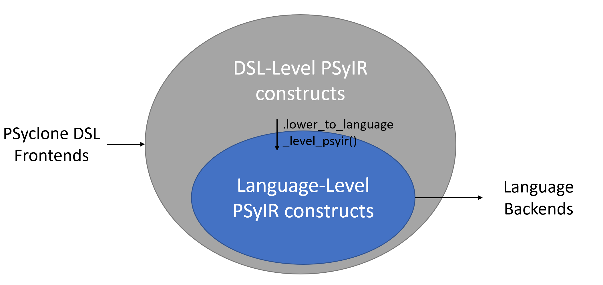

.. -----------------------------------------------------------------------------
   BSD 3-Clause License

   Copyright (c) 2017-2022, Science and Technology Facilities Council.
   All rights reserved.

   Redistribution and use in source and binary forms, with or without
   modification, are permitted provided that the following conditions are met:

   * Redistributions of source code must retain the above copyright notice,
     this list of conditions and the following disclaimer.

   * Redistributions in binary form must reproduce the above copyright notice,
     this list of conditions and the following disclaimer in the documentation
     and/or other materials provided with the distribution.

   * Neither the name of the copyright holder nor the names of its
     contributors may be used to endorse or promote products derived from
     this software without specific prior written permission.

   THIS SOFTWARE IS PROVIDED BY THE COPYRIGHT HOLDERS AND CONTRIBUTORS
   "AS IS" AND ANY EXPRESS OR IMPLIED WARRANTIES, INCLUDING, BUT NOT
   LIMITED TO, THE IMPLIED WARRANTIES OF MERCHANTABILITY AND FITNESS
   FOR A PARTICULAR PURPOSE ARE DISCLAIMED. IN NO EVENT SHALL THE
   COPYRIGHT HOLDER OR CONTRIBUTORS BE LIABLE FOR ANY DIRECT, INDIRECT,
   INCIDENTAL, SPECIAL, EXEMPLARY, OR CONSEQUENTIAL DAMAGES (INCLUDING,
   BUT NOT LIMITED TO, PROCUREMENT OF SUBSTITUTE GOODS OR SERVICES;
   LOSS OF USE, DATA, OR PROFITS; OR BUSINESS INTERRUPTION) HOWEVER
   CAUSED AND ON ANY THEORY OF LIABILITY, WHETHER IN CONTRACT, STRICT
   LIABILITY, OR TORT (INCLUDING NEGLIGENCE OR OTHERWISE) ARISING IN
   ANY WAY OUT OF THE USE OF THIS SOFTWARE, EVEN IF ADVISED OF THE
   POSSIBILITY OF SUCH DAMAGE.
   -----------------------------------------------------------------------------
   Written by: R. W. Ford, A. R. Porter and S. Siso, STFC Daresbury Lab

PSyIR Back-ends
###############

PSyIR back-ends translate PSyIR into another form (such as Fortran, C
or OpenCL). Until recently this back-end support has been implemented
within the PSyIR `Node` classes themselves via various `gen*`
methods. However, this approach is getting a little unwieldy.

Therefore PSyclone is transitioning into a `Visitor` pattern approach.
Visitor backends are already being used in the back-end implementations
that translate PSyIR kernel code. This approach separates the code to
traverse a tree from the tree being visited. It is expected that the
existing back-ends (used in the PSy-layer) will migrate to this new
approach over time (more information about the PSy-layer migration
can be found in :ref:`psy_layer_backends`). The back-end visitor code
is stored in `psyclone/psyir/backend`.

Visitor Base code
=================

`visitor.py` in `psyclone/psyir/backend` provides a base class -
`PSyIRVisitor` - that implements the visitor pattern and is designed
to be subclassed by each back-end.

`PSyIRVisitor` is implemented in such a way that the PSyIR classes do
not need to be modified. This is achieved by translating the class
name of the object being visited in the PSyIR tree into the method
name that the visitor attempts to call (using the Python `eval`
function). `_node` is postfixed to the method name to avoid name
clashes with Python keywords.

For example, an instance of the `Loop` PSyIR class would result in
`PSyIRVisitor` attempting to call a `loop_node` method with the PSyIR
instance as an argument. Note the names are always translated to lower
case. Therefore, a particular back-end needs to subclass
`PSyIRVisitor`, provide a `loop_node` method (in this particular example) and
this method would then be called when the visitor finds an instance of
`Loop`. For example::

    from __future__ import print_function
    from psyclone.psyir.visitor import PSyIRVisitor
    class TestVisitor(PSyIRVisitor):
        ''' Example implementation of a back-end visitor. '''

        def loop_node(self, node):
            ''' This method is called if the visitor finds a loop. '''
            print("Found a loop node")

    test_visitor = TestVisitor()
    test_visitor._visit(psyir_tree)

It is up to the sub-class to call any children of the particular
node. This approach was chosen as it allows the sub-class to control
when and how to call children. For example::

    from __future__ import print_function
    from psyclone.psyir.visitor import PSyIRVisitor
    class TestVisitor(PSyIRVisitor):
        ''' Example implementation of a back-end visitor. '''

        def loop_node(self, node):
            ''' This method is called if the visitor finds a loop. '''
            print("Found a loop node")
            for child in node.children:
                self._visit(child)

    test_visitor = TestVisitor()
    test_visitor._visit(psyir_tree)

If a `node` is called that does not have an associated method defined
then `PSyIRVisitor` will raise a `VisitorError` exception. This
behaviour can be changed by setting the `skip_nodes` option to `True`
when initialising the visitor i.e.

::

    test_visitor = TestVisitor(skip_nodes=True)

Any unsupported nodes will then be ignored and their children will be
called in the order that they appear in the tree.

PSyIR nodes might not be direct subclasses of `Node`. For example,
`GOKernelSchedule` subclasses `KernelSchedule` which subclasses
`Routine` which subclasses `Schedule` which subclasses `Node`. This can
cause a problem as a
back-end would need to have a different method for each class e.g. both
a `gokernelschedule_node` and a `kernelschedule_node` method, even if the
required behaviour is the same. Even worse, expecting someone to have
to implement a new method in all back-ends when they subclass a node
(if they don't require the back-end output to change) is overly
restrictive.

To get round the above problem, if the attempt to call a method with
the name of the PSyIR class (with `_node` appended) fails, then the
`PSyIRVisitor` will subsequently call the method name of its parent
(with `_node` appended). This will continue with the `PSyIRVisitor`
working its way through the class hierarchy in method resolution order
until it is successful (or fails for all names and raises an
exception).

This implementation gives the behaviour one would expect from standard
inheritance rules. For example, if a `kernelschedule_node` method is
implemented in the back-end and a `GOKernelSchedule` is found then a
`gokernelschedule_node` method is first tried which fails, then a
`kernelschedule_node` method is called which succeeds. Therefore all
subclasses of `KernelSchedule` will call the `kernelschedule_node`
method (if their particular specialisation has not been added).

One example of the power of this approach makes use of the fact that
all PSyIR nodes have `Node` as a parent class. Therefore, some base
functionality can be added there and all nodes that do not have a
specific method implemented will call this. To see the
class hierarchy, the following code can be written::

    from __future__ import print_function
    class PrintHierarchy(PSyIRVisitor):
        ''' Example of a visitor that prints the PSyIR node hierarchy. '''

        def node_node(self, node):
        ''' This method is called if no specific methods have been
            written. '''
            print("[ {0} start]".format(type(node).__name__))
            for child in node.children:
                self._visit(child)
            print("[ {0} end]".format(type(node).__name__))

    print_hierarchy = PrintHierarchy()
    print_hierarchy._visit(psyir_tree)

In the examples presented up to now, the information from a back-end
has been printed. However, a back-end will generally not want to use
print statements. Output from a `PSyIRVisitor` is supported by
allowing each method call to return a string. Reimplementing the
previous example using strings would give the following::

   
    from __future__ import print_function class
    class PrintHierarchy(PSyIRVisitor):
        ''' Example of a visitor that prints the PSyIR node hierarchy'''

        def node_node(self, node):
            ''' This method is called if the visitor finds a loop '''
            result = "[ {0} start ]".format(type(node).__name__)
            for child in node.children:
                result += self._visit(child)
            result += "[ {0} end ]".format(type(node).__name__)
            return result

    print_hierarchy = PrintHierarchy()
    result = print_hierarchy._visit(psyir_tree)
    print(result)

As most back-ends are expected to indent their output based in some
way on the PSyIR node hierarchy, the `PSyIRVisitor` provides support
for this. The `self._nindent` variable contains the current
indentation as a string and the indentation can be increased by
increasing the value of the `self._depth` variable. The initial depth
defaults to 0 and the initial indentation defaults to two
spaces. These defaults can be changed when creating the back-end
instance. For example::

    print_hierarchy = PrintHierarchy(initial_indent_depth=2,
                                     indent_string="***")

The `PrintHierarchy` example can be modified to support indenting by
writing the following::

    from __future__ import print_function
    class PrintHierarchy(PSyIRVisitor):
        ''' Example of a visitor that prints the PSyIR node hierarchy
        with indentation'''

        def node_node(self, node):
            ''' This method is called if the visitor finds a loop '''
            result = "{0}[ {1} start ]\n".format(self._nindent,
                                                 type(node).__name__)
        self._depth += 1
        for child in node.children:
            result += self._visit(child)
        self._depth -= 1
        result += "{0}[ {1} end ]\n".format(self._nindent,
                                            type(node).__name__)
        return result

    print_hierarchy = PrintHierarchy()
    result = print_hierarchy._visit(psyir_tree)
    print(result)

As a visitor instance always calls the `_visit` method, an alternative
(functor) implementation is provided via the `__call__` method in the
base class. This allows the above example to be called in the
following simplified way (as if it were a function)::

    print_hierarchy = PrintHierarchy()
    result = print_hierarchy(psyir_tree)
    print(result)

The primary reason for providing the above (functor) interface is to
hide users from the use of the visitor pattern. This is the interface
to expose to users (which is why `_visit` is used for the visitor
method, rather than `visit`). An important characteristic of the `__call__`
method is that it will manage the lowering of DSL-concepts because the
backends should not provide specific visitors for concepts that do not relate
directly to the language domain (more information about the lowering step is
provided in the :ref:`psy_layer_backends` section below). This step is done
internally without exposing side effects (e.g. modifications to the provided
tree). This is important because it permits the generation of backend code
without altering the existing PSyIR tree, thus simplifying debugging and
development. For instance the walk statement in the following example will
return the same nodes, regardless of whether or not the print statement
is commented out::

    print_hierarchy = PrintHierarchy()
    # print(print_hierarchy(psyir_tree))
    psyir_tree.walk(APIHaloExchange)

.. note::
    The property of not having side effects is implemented by making a copy
    of the whole tree provided as an argument to the visitor functor. An
    alternative that was explored was modifying the lowering implementation
    so that it returned a new sub-tree instead of modifying the current one
    in-place. This turned out to be complicated as the lowering method doesn't
    have a well defined region where the modification can happen (e.g. a DSL
    concept could need the addition of imports and new symbols defined in
    an ancestor symbol table).

PSyIR Validation
================

Although the validity of parent-child relationships is checked during the
construction of a PSyIR tree (see e.g. :ref:`nodesinfo-label`), there are
often constraints that can only be checked once the tree is complete i.e.
at the point that a backend is used to generate code. One such example
is that an OpenMP `do` directive must appear within an OpenMP `parallel`
region.

The base PSyVisitor class provides support for this validation by
calling the `validate_global_constraints()` method of each Node that
it visits. The `Node` base class contains an empty implementation of
this method. Therefore, if a subclass of `Node` is subject to certain
global constraints then it must override this method and implement the
required checks. If those checks fail then the method should raise a
`GenerationError`.

Note that, if required, this validation may be disabled by passing
`check_global_constraints=False` when constructing the PSyIRVisitor
instance::

    print_hierarchy = PrintHierarchy(check_global_constraints=False)

 
Available back-ends
===================

Currently, there are two back-ends capable of generating Kernel
code (a KernelSchedule with all its children), these are:

- `FortranWriter()` in `psyclone.psyir.backend.fortran`
- `OpenCLWriter()` in `psyclone.psyir.backend.opencl`

Additionally, there are two partially-implemented back-ends

- `psyclone.psyir.backend.c` which is currently limited to processing
  partial PSyIR expressions.
- `SIRWriter()` in `psyclone.psyir.backend.sir` which can generate
  valid SIR from simple Fortran code conforming to the NEMO API.

SIR back-end
============

The SIR back-end is limited in a number of ways:

- only Fortran code containing 3 dimensional directly addressed
  arrays, with simple stencil accesses, iterated with triply nested
  loops is supported. Imperfectly nested loops, doubly nested loops,
  etc will cause a ``VisitorError`` exception.
- anything other than real arrays (integer, logical etc.) will cause
  incorrect SIR code to be produced (see issue #468).
- calls are not supported (and will cause a VisitorError exception).
- loop bounds are not analysed so it is not possible to add in offset
  and loop ordering for the vertical. This also means that the ordering
  of loops (lat/lon/levels) is currently assumed.
- Fortran literals such as `0.0d0` are output directly in the
  generated code (but this could also be a frontend issue).
- the only unary operator currently supported is '-'.

The current implementation also outputs text rather than running Dawn
directly. This text needs to be pasted into another script in order to
run Dawn, see :ref:`user_guide:nemo-eg4-sir` the NEMO API example 4.

Currently there is no way to tell PSyclone to output SIR. Outputting
SIR is achieved by writing a script which creates an SIRWriter and
outputs the SIR (for kernels) from the PSyIR. Whilst the main
'psyclone' program could have a '-backend' option added it is not
clear this would be useful here as it is expected that the SIR will be
output only for certain parts of the PSyIR and (an)other back-end(s)
used for the rest. It is not yet clear how best to do this - perhaps
mark regions using a transformation.

It is unlikely that the SIR will be able to accept full NEMO code due
to its complexities (hence the comment about using different
back-ends in the previous paragraph). Therefore the approach that will
be taken is to use PSyclone to transform NEMO to make regions that
conform to the SIR constraints and to make these as large as
possible. Once this is done then PSyclone will be used to generate and
optimise the code that the SIR is not able to optimise and will let
the SIR generate code for the bits that it is able to do. This
approach seems a robust one but would require interface code between
the Dawn generated cuda (or other) code and the PSyclone generated
Fortran. In theory PSyclone could translate the remaining code to C
but this would require no codeblocks in the PSyIR when parsing NEMO
(which is a difficult thing to achieve), or interface code between
codeblocks and the rest of the PSyIR.

As suggested by the Dawn developers, PSyIR local scalar variables are
translated into temporary SIR fields (which are 3D arrays by
default). The reason for doing this is that it is easy to specify
variables in the SIR this way (whereas I did not manage to get scalar
declarations working) and Dawn optimises a temporary field, reducing
it to its required dimensionality (so PSyIR local scalar variables are
output as scalars by the Dawn back end even though they are specified
as fields). A limitation of the current translation from PSyIR to SIR
is that all PSyIR scalars are assumed to be local and all PSyIR arrays
are assumed to be global, which may not be the case. This limitation
is captured in issue #521.

.. _psy_layer_backends:

Back-ends for the PSy-layer
===========================

The additional complexity of the PSy-layer comes from the fact that it
contains multiple domain-specific concepts and parallel concepts that are not
part of the target languages. Instead of dealing with these concepts in the
visitors we require that any domain-specific concept introduced on top
of the core PSyIR constructs contains the logic to lower this concept
into language level constructs. The reasons for choosing a method instead
of a visitor for this transformation are:

- Each concept introduced by the API-developer will need lowering instructions,
  and this is better implied by an abstract class in the node that needs to
  be filled.
- The lowering is done in-place. A method fits better with modifying the AST
  in-place because it can use and modify the nodes private fields.

The current proposed solution is to create a 2-phase generation workflow where
a domain-specific PSyIR is first lowered to a language-level version of the
PSyIR using the ``lower_to_language_level`` node method and then processed by
the Visitor to generate the target language.
The language-level PSyIR is still the same IR but restricted to the subset
of Nodes that have a direct translation into target language concepts.

.. note:: Using the language backends to generate the PSy-layer code
 is supported by the Nemo and GOcean APIs. For the GOcean API the
 algorithm-layer is also generated using the language
 backends. LFRic support is still under development, see #1010.
