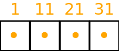
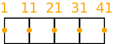
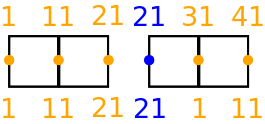

.. _developers-guide:

Developers' guide
*****************

Working With PSyclone from GitHub
#################################

A PSyclone developer will, by definition, be working with the GitHub
PSyclone repository rather than installing a released version from
pypi (using e.g. ``pip install psyclone``).  This section describes
the set-up necessary when using PSyclone in this way. It also
describes some of the development practises of the PSyclone project.

.. _dev-installation:

Installation
============

Although PSyclone releases always work with a released version of
fparser, the same is not always true of other versions (e.g. the HEAD
of the master branch). For those versions of PSyclone requiring
fparser functionality that is not yet in a release, we use the git
submodule feature such that the PSyclone repository always has a link
to the correct version of fparser. In order to obtain this version
the PSyclone repository must be cloned with the ``--recursive`` flag::
  
   > git clone --recursive https://github.com/stfc/PSyclone.git

Alternatively, if you already have a local clone of the PSyclone github
repository then doing::

  > cd <PSYCLONEHOME>
  > git submodule init
  > git submodule update

will fetch the fparser submodule. (Failure to do this will mean that
the ``<PSYCLONEHOME>/external/fparser`` directory will be empty.)

Note that after cloning the repository from GitHub, the local copy
will be on the master branch. If you are working with some other
branch then this must be checked out by doing::

  > cd <PSYCLONEHOME>
  > git checkout <BRANCH_NAME>

Once the above steps have been performed, the
``<PSYCLONEHOME>/external/fparser`` directory will contain the correct
version of the fparser code. This can then be installed using ``pip``::

  > cd <PSYCLONEHOME>/external/fparser
  > pip install --user .

Once you have the correct version of fparser installed you are ready to
install PSyclone itself. Again, the simplest way of doing this is to use
``pip``::

  > cd <PSYCLONEHOME>
  > pip install -e --user .

where ``-e`` requests an 'editable' installation so that changes to
the PSyclone source are immediately reflected in the installed
package.  (For alternatives to using pip please see the
:ref:`getting-going` section.)

Test Suite
==========

The PSyclone test suite is integral to the development process and all
new code must be covered (i.e. executed) by one or more tests. As
described in :ref:`getting-going`, the test suite is written for use
with ``pytest``.

Coverage
--------

The easiest and most user-friendly way of checking the coverage of any
new code is to use CodeCov (https://codecov.io/gh/stfc/PSyclone) which
is integrated with GitHub. Coverage for Pull Requests is automatically
reported and will appear as a comment on the Pull Request. This
comment is then automatically updated whenever new code is pushed to
the associated branch.

For checking test coverage on your local machine you will need to install
the ``cov`` plugin (``pip install pytest-cov``). You can then
request various types of coverage report when running the test suite. e.g.
to ask for a terminal report of missed lines for the ``dynamo0p3`` module
you would do::

  > cd <PSYCLONEHOME>
  > py.test --cov-report term-missing --cov psyclone.dynamo0p3

This will produce output along the lines of::
  
  ----------- coverage: platform linux, python 3.5.4-final-0 -----------
  Name                        Stmts   Miss  Cover   Missing
  ---------------------------------------------------------
  src/psyclone/dynamo0p3.py    2540     23    99%   558, 593, 777, 2731, 2972, 3865, 4132-4133, 4135-4136, 4139-4140, 4143-4144, 4149-4151, 4255, 4270, 4488, 5026, 6540, 6658, 6768

showing the line numbers which are not covered.

Parallel execution
------------------

The size of the test suite is such that running all of it in serial
can take many minutes, especially if you have requested a coverage
report. It is therefore very helpful to run it in parallel and pytest
provides support for this via the ``xdist`` plugin (``pip install
pytest-xdist``). Once you have this plugin, the test suite may be run
in parallel simply by providing the number of cores to use via the
``-n`` flag::

  > cd <PSYCLONEHOME>
  > py.test -n 4

Running the test suite in parallel also changes the order in which
tests are run which can reveal any problems resulting from tests not
being sufficiently isolated from one another.

Gotchas
-------

Note that pytest will not complain if two tests (within a module) have
the same name - it will just silently ignore one of them! The best way
of checking for this is to run pylint on any modified test modules.
(This needs to be done anyway as one of the requirements of the
:ref:`code-review` is that all new code be pylint-clean.)

Compilation testing
-------------------

The test suite provides support for testing that the code generated by
PSyclone is valid Fortran. This is performed by writing the generated
code to file and then invoking a Fortran compiler. This testing is not
performed by default since it requires a Fortran compiler and
significantly increases the time taken to run the test suite.  Since
configuration of these tests uses a pytest fixture, the tests must be
run from the ``tests`` directory when requesting that compilation
checks be performed::

  > cd <PSYCLONEHOME>/src/psyclone/tests
  > py.test --compile

The Gnu Fortran compiler (gfortran) is used by default. If you wish to
use a different compiler and/or supply specific flags then these are
specified by further command-line flags::

  > py.test --compile --f90=ifort --f90flags="-O3"

Note that compilaton testing is currently only supported for the
"dynamo0.3" API. Since the code generated by PSyclone makes calls to the
LFRic infrastructure, we maintain a stub implementation of the necessary
routines in ``tests/test_files/dynamo0p3/infrastructure``.

Continuous Integration
======================

The PSyclone project uses Travis (https://travis-ci.org/stfc/PSyclone)
for continuous integration. GitHub triggers Travis to execute the test
suite whenever there is a push to the repository. The work performed
by Travis is configured by the ``.travis.yml`` file in the root
directory of the repository. Currently Travis is configured to run the
test suite for both Python 2.7 and 3.6.

By default, the Travis configuration uses ``pip`` to install the
dependencies required by PSyclone before running the test suite. This
works well when PSyclone only depends upon released versions of other
packages. However, PSyclone relies heavily upon fparser which is also
under development. Occasionally it may be that a given branch of
PSyclone requires a version of fparser that is not yet released. As
described in :ref:`dev-installation`, PSyclone has fparser as a git
submodule. In order to configure Travis to use that version of fparser
instead of a release, the ``.travis.yml`` file must be edited and the
line executing the "install_optional.sh" script (in the
``before_install`` section) must be edited to pass in the
"fparser_submodule" argument::

    - ./bin/install_optional.sh fparser_submodule

Note that this functionality is only for development purposes. Any
release of PSyclone must work with a released version of fparser
and therefore the "fparser_submodule" argument must be removed
before making a release.

Given that a run of the test-suite on Travis uses approximately 45
minutes of CPU time, it is good practise to avoid triggering it
unnecessarily (e.g. if you know that a certain commit won't
pass). This can be achieved by appending "[skip ci]" (without the
quotes) to the end of the associated git commit message.

.. _code-review:

Code Review
===========

Before a branch can be merged to master it must pass code review. The
guidelines for performing a review (i.e. what is expected from the
developer) are available on the GitHub PSyclone wiki pages:
https://github.com/stfc/PSyclone/wiki.

New APIs
########

TBD

.. Generating API-specific code
.. ============================
.. 
.. This section explains how to create a new API in PSyclone. PSyclone
.. currently supports the following API's; the original prototype gungho
.. implementation, dynamo versions 0.1 and 0.3, and gocean versions 0.1
.. and 1.0.
.. 
.. config.py
.. ---------
.. 
.. The names of the supported API's and the default API are specified in
.. `config.py`. When adding a new API you must add the name you would like
.. to use to the `SUPPORTEDAPIS` list (and change the `DEFAULTAPI` if
.. required).
.. 
.. parse.py
.. --------
.. 
.. The parser reads the algorithm code and associated kernel metadata.
.. 
.. The parser currently assumes that all API's will use the `invoke()`
.. API for the algorithm-to-psy layer but that the content and structure
.. of the metadata in the kernel code may differ. If the algorithm API
.. differs, then the parser will need to be refactored. This is beyond
.. the scope of this document and is currently not considered in the
.. PSyclone software architecture.
.. 
.. The kernel metadata however, will be different from one API to
.. another. To parse this kernel-API-specific metadata a
.. `KernelTypeFactory` is provided which should return the appropriate
.. `KernelType` object. When adding a new API a new API-specific subclass
.. of `KernelType` should be created and added to the `create()` method
.. in the `KernelTypeFactory` class. If the kernel metadata happens to be
.. the same as another existing API then the existing `KernelType`
.. subclass can be used for the new API.
.. 
.. The `KernelType` subclass needs to specialise the class constructor
.. and initialise the `KernelType` base class with the
.. supplied arguments. The role of the `KernelType` subclass is to create
.. a kernel-metadata-specific subclass of the `Descriptor` class and
.. populate this with the relevant API-specific metadata. After doing
.. this is appends the kernel-metadata-specific subclass instance is
.. appended to the `_arg_descriptors` list provided by the `KernelType`
.. base class.
.. 
.. TBC
.. 
.. This information
.. 
.. KernelType base class assumes kernel metadata stored as a type. Searches for that type.
.. Checks whether the metadata is public (it should be ?)
.. Assumes iterates_over variable.
.. Binding to a procedure - assumes one of two styles.
.. Assumes a meta_args type
.. *What about our func_args type???*
.. 
.. type x
.. meta_args=
.. *meta_func=*
.. iterates_over=
.. code => or code =
.. end type x
.. 
.. The descriptor class ...
.. 
.. psyGen.py
.. ---------
.. 
.. factory
.. +++++++
.. 
.. A new file needs to be created and the following classes found in
.. psyGen.py need to be subclassed.
.. 
.. PSy, Invokes, Invoke, Schedule, Loop, Kern, Arguments, Argument
.. You may also choose to subclass the Inf class if required.
.. 
.. The subclass of the PSy class then needs to be added as an option to
.. the create method in the PSyFactory class.
.. 
.. Initialisation
.. ++++++++++++++
.. 
.. The parser information passed to the PSy layer is used to create an
.. invokes object which in turn creates a list of invoke objects. Each
.. invoke object contains a schedule and a schedule consists of loops and
.. calls. Finally, a call contains an arguments object which itself
.. contains a list of argument objects.
.. 
.. To make sure the subclass versions of the above objects are created
.. the __init__ methods of the subclasses must make sure they create
.. the appropriate objects.
.. 
.. Some of the baseclass constructors (__init__ methods) support the
.. classname being provided. This allow them to instantiate the
.. appropriate objects without knowing what they are.
.. 
.. gen_code()
.. ++++++++++
.. 
.. All of the above classes (with the exception of PSy which supports a
.. gen() method) have the gen_code() method. This method passes the
.. parent of the generation tree and expect the object to add the code
.. associated with the object as a child of the parent. The object is
.. then expected to call any children. This approach is powerful as it
.. lets each object concentrate on the code that it is responsible for.
.. 
.. Adding code in gen_code()
.. +++++++++++++++++++++++++
.. 
.. The f2pygen classes have been developed to help create appropriate
.. fortran code in the gen_code() method.
.. 
.. When writing a gen_code() method for a particular object and API it is
.. natural to add code as a child of the parent provided by the callee of
.. the method. However, in some cases we do not want code to appear at
.. the current position in the hierarchy.
.. 
.. The add() method
.. ++++++++++++++++
.. 
.. PSyclone supports this via the add() method
.. 
.. explicitly place at the appropriate place in the hierarchy. For example,
.. parent.parent.add(...)
.. 
.. optional argument. default is auto. This attempts to place code in the
.. expected place. For example, specify a declaration. auto finds a
.. correct place to put this code.
.. 
.. Specify position explicitly
.. "before", "after", "first", "last"
.. 
.. Sometimes don't know exactly where to place. On example that is
.. supported is when you want to add something before or after a loop
.. nest. start_parent_loop(). This method recurses up until the parent is
.. not a loop, it then skips any comments (as they may be directives) and
.. return this position. Therefore supports an arbitrary number of loops
.. and directives.

Existing API's
##############

.. _dynamo0.3-developers:

Dynamo0.3
=========

Mesh
----

The Dynamo0.3 API supports meshes that are unstructured in the
horizontal and structured in the vertical. This is often thought of as
a horizontal 2D unstructured mesh which is extruded into the
vertical. The LFRic infrastructure represents this mesh as a list of
2D cells with a scalar value capturing the number of levels in the
vertical "column".

Cells
-----

The Dynamo0.3 API currently assumes that all kernels which support
iterating over cells work internally on a column of cells. This means
that PSyclone need only be concerned with iterating over cell-columns
in the horizontal. As a result the LFRic infrastructure presents the
mesh information to PSyclone as if the mesh were 2-dimensional. From
now on this 2D view will be assumed i.e. a cell will actually be a
column of cells. The LFRic infrastracture provides a global 2D cell
index from 1 to the number of cells.

For example, a simple quadrilateral element mesh with 4 cells might be
indexed in the following way.

.. image:: cells_global.png
	   :width: 120

When the distributed memory option is switched on in the Dynamo0.3 API
(see the :ref:`distributed_memory` Section) the cells in the model are
partitioned amongst processors and halo cells are added at the
boundaries to a depth determined by the LFRic infrastructure. In this
case the LFRic infrastructure maintains the global cell index and
adds a unique local cell index from 1 to the number of cells in each
partition, including any halo cells.

An example for a depth-1 halo implementation with the earlier mesh
split into 2 partitions is given below, with the halo cells being
coloured red. An example local indexing scheme is also provided below
the cells. Notice the local indexing scheme is set up such that owned
cells have lower indices than halo cells.

.. image:: cells_distributed.png
	   :width: 200

Dofs
----

In the LFRic infrastracture the degrees-of-freedom (dofs) are indexed
from 1 to the total number of dofs. The infrastructure also indexes
dofs so that the values in a column are contiguous and their values
increase in the vertical. Thus, given the dof indices for the "bottom"
cell, the rest of the dof indices can be determined for the
column. This set of dof indices for the bottom cell is called a
dofmap.

Dofs represent a field's values at various locations in the
mesh. Fields can either be continuous or discontinuous. Continuous
fields are so named because their values are continuous across cell
boundaries. Dofs that represent continuous fields are shared between
neighbouring cells. Discontinuous fields have values that are not
necessarily related between neighbouring cells (there can be
discontinuities across cell boundaries). Dofs that represent
discontinuous fields are local to a cell.

Discontinuous Dofs
------------------

A simple example of discontinuous dofs is given below. In this case
each cell contains 1 dof and there are 10 cells in a column. We only
show the bottom cells and their corresponding dof indices. As
explained earlier, the dof indices increase contiguously up the
column, so the cell above the cell containing dof index 1 contains dof
index 2 and the cell above that contains dof index 3 etc.

As discussed in the previous section, when the distributed memory
option is switched on in the Dynamo0.3 API (see the
:ref:`distributed_memory` Section) the cells in the model are
partitioned amongst processors and halo cells are added at the
boundaries to a depth determined by the LFRic infrastructure. This
results in the dofs being replicated in the halo cells, leading to a
dof halo. As for cells, the LFRic infrastructure maintains the global
dof indexing scheme and adds a local dof indexing scheme from 1 to the
number of dofs in each partition, including any halo dofs.

An example for a depth-1 halo implementation with the earlier mesh
split into 2 partitions is given below, with the halo cells drawn in
grey and halo dofs coloured red. An example local partition indexing
scheme is also provided below the dofs. As with cells, notice the
local indexing scheme ensures that owned dofs have lower indices than
halo dofs.

.. image:: dofs_disc_distributed.png
	   :width: 200

Continuous Dofs
---------------

A simple continuous dof example is given below for the same mesh as
before. In this case dofs are on cell edges in the horizontal and
there are 10 cells in a column. Again we only show the bottom cells
and their corresponding dof indices. As explained earlier, the dof
indices increase contiguously up the column, so the cell above the
cell containing dof index 1 contains dof index 2 and the cell above
that contains dof index 3 etc.

As already explained, when the distributed memory option is switched
on in the Dynamo0.3 API (see the :ref:`distributed_memory` Section)
the cells in the model are partitioned amongst processors and halo
cells are added at the boundaries.

In the example below we ignore the additional halo cells and just look
at the partitioning of cells amongst processors (with the same mesh
and 2 partitions as shown earlier). It can be seen that the dofs
shared between cells which are on different partitions now need to be
replicated if fields on continuous dofs are going to be able to be
computed locally on each partition. This concept is different to halos
as there are no halo cells here, the fact that the cells are
partitioned has meant that continuous dofs on the edge of the
partition are replicated. The convention used in Dynamo0.3 is that the
cell with the lowest global id determines which partition owns a
dof and which has the copy. Dofs which are copies are called
`annexed`. Annexed dofs are coloured blue in the example:

If we now extend the above example to include the halo cells (coloured
grey) then we get:

.. image:: dofs_cont_halos.png
	   :width: 230
		   
An example for a depth-1 halo implementation with the earlier mesh
split into 2 partitions is given below, with the halo cells drawn in
grey and halo dofs coloured red. An example local indexing scheme is
also provided below the dofs. Notice the local indexing scheme ensures
that owned dofs have lower indices than annexed dofs, which in turn
have lower indices than halo dofs.

Cell and Dof Ordering
---------------------

Cells in a partition are sequentially indexed by the LFRic
infrastructure, starting at 1, so that local cells occur first, then
level-1 halo cells, then level-2 halo cells etc. A benefit of this
layout is that it makes it easy for PSyclone to specify the required
iteration space for cells as a single range, allowing a single Fortran
do loop (or other language construct as required) to be generated. The
LFRic infrastructure provides an API that returns the index of the
last owned cell, the index of the last halo cell at a particular depth
and the index of the last halo cell, to support PSyclone code
generation.

Dofs on a partition are also sequentially indexed by the LFRic
infrastructure, starting at 1, so that local dofs occur first, then
annexed dofs (if the field is continuous), then level-1 halo dofs,
then level-2 halo dofs etc. Again, this layout makes it easy for
PSyclone to specify the required iteration space for dofs as a single
range. As before, the LFRic infrastructure provides an API that
returns the index of the last owned dof, the index of the last annexed
dof, the index of the last halo dof at a particular depth and the
index of the last halo dof, to support PSyclone code generation.

Multi-grid
----------

The Dynamo 0.3 API supports kernels that map fields between meshes of
different horizontal resolutions. As indicated in the image below, the
change in resolution between each level is always a factor of two in
both the x and y dimensions:

.. image:: multigrid.png
	   :width: 600

Each mesh in the multi-grid hierarchy is coloured separately
(https://code.metoffice.gov.uk/trac/lfric/wiki/LFRicInfrastructure/MeshColouring)
and therefore we cannot assume any relationship between the colour
maps of meshes of differing resolution.

Loop iterators
--------------

In the current implementation of the Dynamo0.3 API it is possible to
iterate (loop) either over cells or dofs. At the moment all coded
kernels are written to iterate over cells and all builtin kernels are
written to iterate over dofs, but that does not have to be the case.

The loop iteration information is specified in the kernel metadata. In
the case of builtin's there is kernel metadata but it is part of
PSyclone and is specified in
`src/psyclone/dynamo0p3_builtins_mod.f90`.

For inter-grid kernels, it is the coarse mesh that provides the iteration
space. (The kernel is passed a list of the cells in the fine mesh that are
associated with the current coarse cell.)

Cell iterators: Continuous
--------------------------

When a kernel is written to iterate over cells and modify a continuous
field, PSyclone always computes dofs on owned cells and redundantly
computes dofs in the level-1 halo. Users can apply a redundant
computation transformation to increase the halo depth for additional
redundant computation but it must always at least compute the level-1
halo. The reason for this is to ensure that the shared dofs on cells
on the edge of the partition (both owned and annexed) are always
correctly computed. Note that the outermost halo dofs are not
correctly computed and therefore the outermost halo of the modified
field is dirty after redundant computation. Also note that if we do
not know whether a modified field is discontinuous or continuous then
we must assume it is continuous.

An alternative solution could have been adopted in Dynamo0.3 whereby
no redundant computation is performed and partial-sum results are
shared between processors in a communication pattern similar to halo
exchanges. However, a decision was made to always perform redundant
computation.

A downside of performing redundant computation in the level-1 halo is
that any fields being read by the kernel must have their level-1 halo
clean (up-to-date), which can result in halo exchanges. Note that this
is not the case for the modified field, it does not need its halo to
be clean, however, at the moment a halo exchange is added in this
case. This unecessary halo exchange will be removed in a future
release of PSyclone.

Cell iterators: Discontinuous
-----------------------------

When a kernel is written to iterate over cells and modify a
discontinuous field, PSyclone only needs to compute dofs on owned
cells. Users can apply a redundant computation transformation to
redundantly compute into the halo but this is not done by default.

.. _annexed_dofs:

Dof iterators
-------------

When a kernel that is written to iterate over dofs modifies a field,
PSyclone must ensure that all dofs in that field are updated. If the
distributed memory flag is set to ``false`` then PSyclone must iterate
over all dofs. PSyclone simply needs to create a loop that iterates
from 1 to the total number of dofs. The latter value is provided by
the LFRic API.

If the distributed memory flag is set to ``true`` then PSyclone must
ensure that each partition only iterates over owned dofs. Again PSyclone
just needs to create a loop that iterates from 1 to the total number
of owned dofs on that partition. The latter value is provided by the
LFRic API.

When the distributed memory flag is set to ``true`` an aditional
configuration option can be set which makes PSyclone always create
loops which iterate over both owned and annexed dofs. Whilst this is
not necessary for correctness, it can improve performance by reducing
the number of halo exchanges required (at the expense of computing
annexed dofs redundantly). The only change for PSyclone is that it
calls a different LFRic routine which returns the index of the last
annexed dof. This iteration space will necessarily also include all
owned dofs due to the ordering of dof indices discussed earlier.

The configuration variable is called `COMPUTE_ANNEXED_DOFS` and is
found in the the `dynamo0.3` section of the `psyclone.cfg`
configuration file (see :ref:`configuration`). If it is ``true`` then
annexed dofs are always computed in loops that iterate over dofs and
if it is ``false`` then annexed dofs are not computed. The default in
PSyclone is ``false``.

The computation of annexed dofs could have been added as a
transformation optimisation. The reason for using a configuration
switch is that it is then guaranteed that annexed dofs are always
computed for loops that iterate over dofs which then allows us to
always remove certain halo exchanges without needing to add any new
ones.

If we first take the situation where annexed dofs are not computed for
loops that iterate over dofs i.e. (`COMPUTE_ANNEXED_DOFS` is ``false``),
then a field's annexed dofs will be dirty (out-of-date) after the loop
has completed. If a following kernel needs to read the field's
annexed dofs, then PSyclone will need to add a halo exchange to make
them clean.

There are 3 cases to consider:

1) the field is read in a loop that iterates over dofs,
2) the field is read in a loop that iterates over owned cells and
   level-1 halo cells, and
3) the field is read in a loop that iterates over owned cells

In case 1) the annexed dofs will not be read as the loop only iterates
over owned dofs so a halo exchange is not required. In case 2) the
full level-1 halo will be read (including annexed dofs) so a halo
exchange is required. In case 3) the annexed dofs will be read so a
halo exchange will be required.

If we now take the case where annexed dofs are computed for loops that
iterate over dofs (`COMPUTE_ANNEXED_DOFS` is ``true``) then a field's
annexed dofs will be clean after the loop has completed. If a
following kernel needs to read the field's annexed dofs, then
PSyclone will no longer need a halo exchange.

We can now guarantee that annexed dofs will always be clean after a
continuous field has been modified by a kernel. This is because loops
that iterate over either dofs or cells now compute annexed dofs and
there are no other ways for a continuous field to be updated.

We now consider the same three cases. In case 1) the annexed dofs will
now be read, but annexed dofs are guaranteed to be clean, so no halo
exchange is required. In case 2) the full level-1 halo is read so a
halo exchange is still required. Note, as part of this halo exchange
we will update annexed dofs that are already clean. In case 3) the
annexed dofs will be read but a halo exchange is not required as the
annexed dofs are guaranteed to be clean.

Therefore no additional halo exchanges are required when
`COMPUTE_ANNEXED_DOFS` is changed from ``false`` to ``true`` i.e. case 1)
does not require a halo exchange in either situation and case 2)
requires a halo exchange in both situations. We also remove halo
exchanges for case 3) so the number of halo exchanges may be reduced.

If a switch were not used and it were possible to use a transformation
to selectively perform computation over annexed dofs for loops that
iterate over dofs, then we would no longer be able to guarantee that
annexed dofs would always be clean. In this situation, if the dofs
were known to be dirty then PSyclone would need to add a halo exchange
and if it were unknown whether the dofs were dirty or not, then a halo
exchange would need to be added that uses the run-time flags to
determine whether a halo exchange is required. As run-time flags are
based on whether the halo is dirty or not (not annexed dofs) then a
halo exchange would be performed if the halo were dirty, even if the
annexed dofs were clean, potentially resulting in more halo exchanges
than are necessary.

Halo Exchange Logic
-------------------

Halo exchanges are required when the `DISTRIBUTED_MEMORY` flag is set to
``true`` in order to make sure any accesses to a field's halo or to its
annexed dofs receive the correct value.

Operators and Halo Exchanges
++++++++++++++++++++++++++++

Halo Exchanges are only created for fields. This causes an issue for
operators. If a loop iterates over halos to a given depth and the loop
includes a kernel that reads from an operator then the operator must
have valid values in the halos to that depth. In the current
implementation of PSyclone all loops which write to, or update an
operator are computed redundantly in the halo up to depth-1 (see the
`load()` method in the `DynLoop` class). This implementation therefore
requires a check that any loop which includes a kernel that reads from
an operator is limited to iterating in the halo up to
depth-1. PSyclone will raise an exception if an optimisation attempts
to increase the iteration space beyond this (see the `gen_code()`
method in the `DynKern` class).

To alleviate the above restriction one could add a configurable depth with
which to compute operators e.g. operators are always computed up to
depth-2, or perhaps up to the maximum halo depth. An alternative would
be to halo exchange operators as required in the same way that halo
exchanges are used for fields.

First Creation
++++++++++++++

When first run, PSyclone creates a separate schedule for each of the
invokes found in the algorithm layer. A schedule includes all required
loops and kernel calls that need to be generated in the PSy layer for
the particular invoke call. Once the loops and kernel calls have been
created then (if the `DISTRIBUTED_MEMORY` flag is set to ``true``) PSyclone
adds any required halo exchanges and global sums. This work is all
performed in the `DynInvoke` constructor (`__init__`) method.

In PSyclone we apply a lazy halo exchange approach (as opposed to an
eager one), adding a halo exchange just before it is required.

It is simple to determine where halo exchanges should be added for the
initial schedule. There are three cases:

1) loops that iterate over cells and modify a continuous field will
   access the level-1 halo. This means that any field that is read
   within such a loop must have its level-1 halo clean and therefore
   requires a halo exchange. Note, at the moment PSyclone adds a halo
   exchange for the modified field (as it is specified as `GH_INC`
   which requires a read before a write), however this is not required
   if there is only one field updated in the kernel. This is because
   we only care about updating owned and annexed dofs, therefore it
   does not matter what the values of any halo dofs are.

2) continuous fields that are read from within loops that iterate over
   cells and modify a discontinuous field must have their annexed dofs
   clean. Currently the only way to make annexed dofs clean is to
   perform a halo exchange. If the `COMPUTE_ANNEXED_DOFS`
   configuration variable is set to ``true`` then no halo exchange is
   required as annexed dofs will always be clean. If the
   `COMPUTE_ANNEXED_DOFS` configuration variable is set to ``false``
   then a halo exchange must be added if the previous modification of
   the field is known to be from within a loop over dofs, or if the
   previous modification of the field is unknown (i.e. outside the
   invoke) as the previous modification may have been from within a
   loop over dofs.

3) fields that have a stencil access will access the halo and need
   halo exchange calls added.

Halo exchanges are created separately (for fields with halo reads) for
each loop by calling the `create_halo_exchanges()` method within the
`DynLoop` class.

In the situation where a field's halo is read in more than one kernel
in different loops, we do not want to add too many halo exchanges -
one will be enough as long as it is placed correctly. To avoid this
problem we add halo exchange calls for loops in the order in which
they occur in the schedule. A halo exchange will be added before the
first loop for a field but the same field in the second loop will find
that there is a dependence on the previously inserted halo exchange so
no additional halo exchange will be added.

The algorithm for adding the necessary halo exchanges is as follows:
For each loop in the schedule, the `create_halo_exchanges()` method
iterates over each field that reads from its halo (determined by the
`unique_fields_with_halo_reads()` method in the `DynLoop` class).

For each field we then look for its previous dependencies (the
previous writer(s) to that field) using PSyclone's dependence
analysis. Three cases can occur: 1) there is no dependence, 2) there
are multiple dependencies and 3) there is one dependence.

1) If no previous dependence is found then we add a halo exchange call
   before the loop (using the internal helper method
   `_add_halo_exchange()`). If the field is a vector field then a halo
   exchange is added for each component. The internal helper method
   `_add_halo_exchange` itself uses the internal helper method
   `_add_halo_exchange_code()`. This method creates an instance of the
   `DynHaloExchange` class for the field in question and adds it to
   the schedule before the loop. You might notice that this method
   then checks that the halo exchange is actually required and removes
   it again if not. In our current situation the halo exchange will
   always be needed so this check is not required but in more complex
   situations after transformations have been applied to the schedule
   this may not be the case. We discuss this type of situation later.

2) If multiple previous dependencies are found then the field must be
   a vector field as this is the only case where this can occur. We
   then choose the closest one and treat it as a single previous
   dependency (see 3).

3) If a single previous dependency is found and it is a halo exchange
   then we do nothing, as it is already covered. This will only happen
   when more than one reader depends on a writer, as discussed
   earlier. If the dependence is not a halo exchange then we add one.

After completing the above we have all the halo exchanges required for
correct execution.

Note that we do not need to worry about halo depth or whether a halo
is definitely required, or whether it might be required, as this is
determined by the halo exchange itself at code generation time. The
reason for deferring this information is that it can change as
transformations are added.

Modifying the Schedule
----------------------

Transformations modify the schedule. At the moment only one of these
transformations - the `Dynamo0p3RedundantComputationTrans` class in
`transformations.py` - affects halo exchanges. This transformation can
mean there is a requirement for new halo exchanges, it can mean
existing halo exchanges are no longer required and it can mean that
the properties of a halo exchange (e.g. depth) can change.

The redundant computation transformation is applied to a loop in a
schedule. When this is done the `update_halo_exchanges()` method for
that loop is called - see the `apply()` method in
`Dynamo0p3RedundantComputationTrans`.

The first thing that the `update_halo_exchanges()` method does is call
the `create_halo_exchanges()` method to add in any new halo exchanges
that are required before this loop, due to any fields that now have a
read access to their halo when they previously did not. For example, a
loop containing a kernel that writes to a certain field might
previously have iterated up to the number of owned cells in a
partition (`ncells`) but now iterates up to halo depth 1.

However, a field that has its halo read no longer guarantees that a
halo exchange is required, as the previous dependence may now compute
redundantly to halo depth 2, for example. The solution employed in
`create_halo_exchanges()` is to add a halo exchange speculatively and
then remove it if it is not required. The halo exchange itself
determines whether it is required or not via the `required()` method. The
removal code is found at the end of the `_add_halo_exchange_code()`
method in the `DynLoop()` class.

The second thing that the `update_halo_exchanges()` method does is check
that any halo exchanges after this loop are still required. It finds
all relevant halo exchanges, asks them if they are required and if
they are not it removes them.

We only need to consider adding halo exchanges before the loop and
removing halo exchanges after the loop. This is because redundant
computation can only increase the depth of halo to which a loop
computes so can not remove existing halo exchanges before a loop (as
an increase in depth will only increase the depth of an existing halo
exchange before the loop) or add existing halo exchanges after a loop
(as an increase in depth will only make it more likely that a halo
exchange is no longer required after the loop).

Colouring
+++++++++

A loop must be coloured when one or more of the kernels it contains
writes to a field on a continuous function space.

GOcean1.0
=========

TBD

.. OpenMP Support
.. --------------
.. 
.. Loop directives are treated as first class entities in the psyGen
.. package. Therefore they can be added to psyGen's high level
.. representation of the fortran code structure in the same way as calls
.. and loops. Obviously it is only valid to add a loop directive outside
.. of a loop.
.. 
.. When adding a call inside a loop the placement of any additional calls
.. or declarations must be specified correctly to ensure that they are
.. placed at the correct location in the hierarchy. To avoid accidentally
.. splitting the loop directive from its loop the start_parent_loop()
.. method can be used. This is available as a method in all fortran
.. generation calls. *We could have placed it in psyGen instead of
.. f2pygen*.  This method returns the location at the top of any loop
.. hierarchy and before any comments immediately before the top level
.. loop.
.. 
.. The OpenMPLoopDirective object needs to know which variables are
.. shared and which are private. In the current implementation default
.. shared is used and private variables are listed. To determine the
.. objects private variables the OpenMP implementation uses its internal
.. xxx_get_private_list() method. This method first finds all loops
.. contained within the directive and adds each loops variable name as a
.. private variable. this method then finds all calls contained within
.. the directive and adds each calls list of private variables, returned
.. with the local_vars() method. Therefore the OpenMPLoopDirective object
.. relies on calls specifying which variables they require being local.
.. 
.. Next ...
.. 
.. Update transformation for colours
.. 
.. OpenMPLoop transformation in transformations.py. 
.. 
.. Create third transformtion which goes over all loops in a schedule and
.. applies the OpenMP loop transformation.

Modules
#######

This section describes the functionality of the various Python modules
that make up PSyclone.

f2pygen
=======

`f2pygen` provides functionality for generating Fortran code from
scratch (i.e. when not modifying existing source).

Variable Declarations
---------------------

Three different classes are provided to support the creation of
variable declarations (for intrinsic, character and derived-type
variables). An example of their use might be:

>>> from psyclone.f2pygen import ModuleGen, SubroutineGen, DeclGen, \
CharDeclGen, TypeDeclGen
>>> module = ModuleGen(name="testmodule")
>>> sub = SubroutineGen(module, name="testsubroutine")
>>> module.add(sub)
>>> sub.add(DeclGen(sub, datatype="integer", entity_decls=["my_int"]))
>>> sub.add(CharDeclGen(sub, length="10", entity_decls=["my_char"]))
>>> sub.add(TypeDeclGen(sub, datatype="field_type", entity_decls=["ufld"]))
>>> gen = str(module.root)
>>> print(gen)
  MODULE testmodule
    IMPLICIT NONE
    CONTAINS
    SUBROUTINE testsubroutine()
      TYPE(field_type) ufld
      CHARACTER(LEN=10) my_char
      INTEGER my_int
    END SUBROUTINE testsubroutine
  END MODULE testmodule

The full interface to each of these classes is detailed below:

.. autoclass:: psyclone.f2pygen.DeclGen
    :members:
    :noindex:

.. autoclass:: psyclone.f2pygen.CharDeclGen
    :members:
    :noindex:

.. autoclass:: psyclone.f2pygen.TypeDeclGen
    :members:
    :noindex:

configuration
=============

PSyclone uses the Python ``ConfigParser`` class
(https://docs.python.org/3/library/configparser.html) for reading the
configuration file. This is managed by the ``psyclone.configuration``
module which provides the ``ConfigFactory`` and ``Config``
classes. The former's constructor creates a singleton ``Config`` instance
and stores it for return by any future calls to ``create``:

.. autoclass:: psyclone.configuration.ConfigFactory
    :members:

The ``Config`` class is responsible for finding the configuration file
(if no filename is passed to the constructor), parsing it and then storing
the various configuration options. It also performs some basic consistency
checks on the values it obtains from the configuration file.

Since the default PSyclone API to use is read from the configuration
file, it is not possible to have API-specifc sub-classes of ``Config``
as we don't know which API is in use before we read the file. However, the
configuration file can contain API-specific settings. These are placed in
separate sections, named for the API to which they apply, e.g.::

  [dynamo0.3]
  COMPUTE_ANNEXED_DOFS = false

Having parsed and stored the options from the default section of the
configuration file, the ``Config`` constructor then creates a
dictionary using the list of supported APIs to provide the keys. The
configuration file is then checked for API-specific sections (again
using the API names from the default section) and, if any are found,
an API-specifc sub-class is created using the parsed entries from the
corresponding section. The resulting object is stored in the
dictionary under the appropriate key. The API-specific values may then
be accessed as, e.g.::

  config.api("dynamo0.3").compute_annexed_dofs

The API-specific sub-classes exist to provide validation/type-checking and
encapsulation for API-specific options. They do not sub-class ``Config``
directly but store a reference back to the ``Config`` object to which they
belong.

transformations
===============

As one might expect, the transformations module holds the various
transformation classes that may be used to modify the Schedule of an
Invoke and/or the kernels called from within it.

The base class for any transformation must be the class ``Transformation``:

.. autoclass:: psyclone.psyGen.Transformation
    :members:
    :private-members:

Those transformations that work on a region of code (e.g. enclosing
multiple kernel calls within an OpenMP region) must sub-class the
``RegionTrans`` class:

.. autoclass:: psyclone.transformations.RegionTrans
    :members:
    :private-members:
    :noindex:

Kernel Transformations
----------------------

Kernel transformations work on the fparser2 AST of the target kernel
code.  This AST is obtained by converting the fparser1 AST (stored
when the kernel code was originally parsed to process the meta-data)
back into a Fortran string and then parsing that with fparser2. (Note
that in future we intend to adopt fparser2 throughout PSyclone so that
this translation between ASTs will be unnecessary.) The `ast` property
of the `psyclone.psyGen.Kern` class is responsible for performing this
translation the first time it is called. It also stores the resulting
AST in `Kern._fp2_ast` for return by future calls.
Transforming a kernel is then a matter of manipulating this AST.
(See `psyclone.transformations.ACCRoutineTrans` for an example.)

OpenACC Support
---------------

PSyclone is able to generate code for execution on a GPU through the
use of OpenACC. Support for generating OpenACC code is implemented via
:ref:`transformations`. The specification of parallel regions and
loops is very similar to that in OpenMP and does not require any
special treatment.  However, a key feature of GPUs is the fact that
they have their own, on-board memory which is separate from that of
the host. Managing (i.e. minimising) data movement between host and
GPU is then a very important part of obtaining good performance.

Since PSyclone operates at the level of Invokes it has no information
about when an application starts and thus no single place in which to
initiate data transfers to a GPU. (We assume that the host is
responsible for model I/O and therefore for populating fields with
initial values.) Fortunately OpenACC provides support for this kind of
situation with the ``enter data`` directive. This may be used to
"define scalars, arrays and subarrays to be allocated in the current
device memory for the remaining duration of the program"
:cite:`openacc_enterdata`. The ``ACCDataTrans`` transformation adds
an ``enter data`` directive to an Invoke:

.. autoclass:: psyclone.transformations.ACCDataTrans

The resulting generated code will then contain an ``enter data``
directive protected by an ``IF(this is the first time in this
Invoke)`` block, e.g. (for the GOcean1.0 API):

.. code-block:: fortran

      ! Ensure all fields are on the device and
      ! copy them over if not.
      IF (first_time) THEN
        !$acc enter data  &
        !$acc& copyin(sshn_t,sshn_t%data,un%grid,un%grid%tmask,...)
        first_time = .false.
        ssha_t%data_on_device = .true.
        ...

Note that the ``IF`` block is not strictly required as the OpenACC
run-time identifies when a reference is already on the device and does
not copy it it over again. However, when profiling an application, it
was seen that there was a small overhead associated with doing the
``enter data``, even when the data was already on the device. The ``IF``
block eliminates this.

Of course, a given field may already be on the device (and have been
updated) due to a previous Invoke. In this case, the fact that the
OpenACC run-time does not copy over the now out-dated host version of
the field is essential for correctness.

