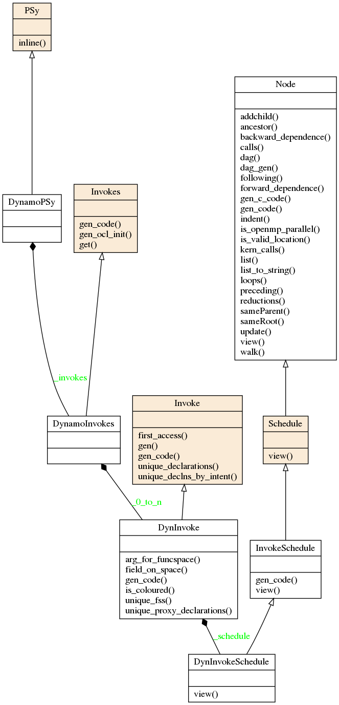

PSy layer
=========

In the PSyKAl separation of concerns, the PSy layer is responsible for
linking together the Algorithm layer and Kernel layer. Its
functional responsibilities are to

1. map the arguments supplied by an Algorithm ``invoke`` call to the arguments required by a Kernel call (as these will not have a one-to-one correspondance).
2. call the Kernel routine so that it covers the required iteration space and
3. include any required distributed memory operations such as halo swaps and reductions.

Its other role is to allow the optimisation expert to optimise any
required distributed memory operations, include and optimise any
shared memory parallelism and optimise for single node (e.g. cache and
vectorisation) performance.

Code Generation
---------------

The PSy layer can be written manually but this is error prone and
potentially complex to optimise. The PSyclone code generation system
generates the PSy layer so there is no need to write the code
manually.

To generate correct PSy layer code, PSyclone needs to understand the
arguments and datatypes passed by the algorithm layer and the
arguments and datatypes expected by the Kernel layer; it needs to know
the name of the Kernel subroutine(s); it needs to know the iteration
space that the Kernel(s) is/are written to iterate over; it also needs
to know the ordering of Kernels as specified in the algorithm
layer. Finally, it needs to know where to place any distributed memory
operations.

PSyclone determines the above information by being told the API in
question (by the user), by reading the appropriate Kernel metadata and
by reading the order of kernels in an invoke call (as specified in the
algorithm layer).

PSyclone has an API-specific parsing stage which reads the algorithm
layer and all associated Kernel metadata. This information is passed
to a PSy-generation stage which creates a high level view of the PSy
layer. From this high level view the PSy-generation stage can generate
the required PSy code.

For example, the following Python code shows a code being parsed, a
PSy-generation object being created using the output from the parser
and the PSy layer code being generated by the PSy-generation object.
::

    from parse import parse
    from psyGen import PSyFactory
    
    # This example uses version 0.1 of the Dynamo API
    api = "dynamo0.1"
    
    # Parse the file containing the algorithm specification and
    # return the Abstract Syntax Tree and invokeInfo objects
    ast, invokeInfo = parse("dynamo.F90", api=api)
    
    # Create the PSy-layer object using the invokeInfo
    psy = PSyFactory(api).create(invokeInfo)
    # Generate the Fortran code for the PSy layer
    print psy.gen

Structure
---------

PSyclone provides a hierarchy of base classes which specific API's can
subclass to support their particular API. All API's implemented so
far, follow this hierarchy.

At the top level is the **PSy** class. The PSy class has an
**Invokes** class. The **Invokes** class can contain one or more
**Invoke** classes (one for each invoke in the algorithm layer). Each
**Invoke** class has a **Schedule** class.

The class diagram for the above base classes is shown below using the
dynamo0.3 API as an illustration. This class diagram was generated
from the source code with pyreverse and edited with inkscape.

API
---

.. autoclass:: psyGen.PSy
    :members:

.. autoclass:: psyGen.Invokes
    :members:

.. autoclass:: psyGen.Invoke
    :members:

.. autoclass:: psyGen.Schedule
    :members:

Schedule
--------

A PSy **Schedule** object consists of a tree of objects which can be
used to describe the required schedule for a PSy layer subroutine
which is called by the algorithm layer and itself calls one or more
Kernels. These objects can currently be a **Loop**, a **Kernel** or a
**Directive** (of various types). The order of the tree (depth first)
indicates the order of the associated Fortran code.

PSyclone will initially create a "vanilla" (functionally correct
but not optimised) schedule.

This "vanilla" schedule can be modified by changing the objects
within it. For example, the order that two Kernel calls appear in the
generated code can be changed by changing their order in the tree. The
ability to modify this high level view of a schedule allows the PSy
layer to be optimised for a particular architecture (by applying
optimisations such as blocking, loop merging, inlining etc.). The tree
could be manipulated directly, however, to simplify optimisation, a
set of transformations are supplied. These transformations are
discussed in the next section.
