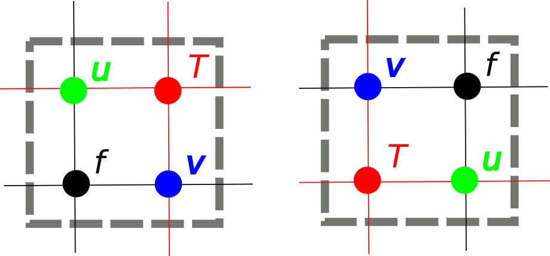
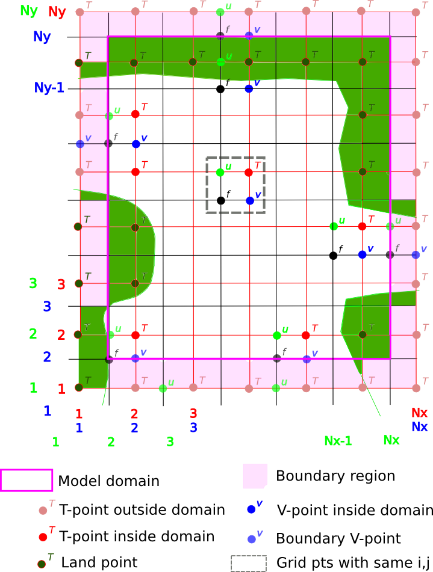

.. -----------------------------------------------------------------------------
.. BSD 3-Clause License
..
.. Copyright (c) 2017-2019, Science and Technology Facilities Council
.. All rights reserved.
..
.. Redistribution and use in source and binary forms, with or without
.. modification, are permitted provided that the following conditions are met:
..
.. * Redistributions of source code must retain the above copyright notice, this
..   list of conditions and the following disclaimer.
..
.. * Redistributions in binary form must reproduce the above copyright notice,
..   this list of conditions and the following disclaimer in the documentation
..   and/or other materials provided with the distribution.
..
.. * Neither the name of the copyright holder nor the names of its
..   contributors may be used to endorse or promote products derived from
..   this software without specific prior written permission.
..
.. THIS SOFTWARE IS PROVIDED BY THE COPYRIGHT HOLDERS AND CONTRIBUTORS
.. "AS IS" AND ANY EXPRESS OR IMPLIED WARRANTIES, INCLUDING, BUT NOT
.. LIMITED TO, THE IMPLIED WARRANTIES OF MERCHANTABILITY AND FITNESS
.. FOR A PARTICULAR PURPOSE ARE DISCLAIMED. IN NO EVENT SHALL THE
.. COPYRIGHT HOLDER OR CONTRIBUTORS BE LIABLE FOR ANY DIRECT, INDIRECT,
.. INCIDENTAL, SPECIAL, EXEMPLARY, OR CONSEQUENTIAL DAMAGES (INCLUDING,
.. BUT NOT LIMITED TO, PROCUREMENT OF SUBSTITUTE GOODS OR SERVICES;
.. LOSS OF USE, DATA, OR PROFITS; OR BUSINESS INTERRUPTION) HOWEVER
.. CAUSED AND ON ANY THEORY OF LIABILITY, WHETHER IN CONTRACT, STRICT
.. LIABILITY, OR TORT (INCLUDING NEGLIGENCE OR OTHERWISE) ARISING IN
.. ANY WAY OUT OF THE USE OF THIS SOFTWARE, EVEN IF ADVISED OF THE
.. POSSIBILITY OF SUCH DAMAGE.
.. -----------------------------------------------------------------------------
.. Written by R. W. Ford and A. R. Porter, STFC Daresbury Lab

.. _gocean1.0-api:

GOcean1.0 API
=============

.. highlight:: fortran

.. _gocean1.0-intro:

Introduction
------------

The GOcean 1.0 application programming interface (API) was originally
designed to support ocean models that use the finite-difference scheme
for two-dimensional domains.  However, the approach is not specific to
ocean models and can potentially be applied to any finite-difference
code.

As with all PSyclone APIs, the GOcean 1.0 API specifies how a user
must write the Algorithm Layer and the Kernel Layer to allow PSyclone
to generate the PSy Layer. These Algorithm and Kernel APIs are
discussed separately in the sections below. Before these we
describe the functionality provided by the GOcean Library.

.. _gocean1.0-library:

The GOcean Library
------------------

The use of PSyclone and the GOcean 1.0 API implies the use of a
standard set of data types and associated infrastructure. This is
provided by version 1.0 of the GOcean Library (GOLib v.1.0).
Currently this library is distributed separately from PSyclone and is
available from http://puma.nerc.ac.uk/trac/GOcean.

.. _gocean1.0-grid:

Grid
++++

The GOLib contains a ``grid_mod`` module which defines a ``grid_type``
and associated constructor::

  use grid_mod
  ...
  !> The grid on which our fields are defined
  type(grid_type), target :: model_grid
  ...
  ! Create the model grid
  model_grid = grid_type(GO_ARAKAWA_C,                                 &
                         (/GO_BC_EXTERNAL,GO_BC_EXTERNAL,GO_BC_NONE/), &
                         GO_OFFSET_NE)

.. note::
  The grid object itself must be declared with the ``target``
  attribute. This is because each field object will contain a pointer to
  it.

The ``grid_type`` constructor takes three arguments:

 1. The type of grid (only GO_ARAKAWA_C is currently supported)
 2. The boundary conditions on the domain for the *x*, *y* and *z* dimensions (see below). The value for the *z* dimension is currently ignored.
 3. The 'index offset' - the convention used for indexing into offset fields.

Three types of boundary condition are currently supported:

.. tabularcolumns:: |l|L|

===============  =========================================
Name             Description
===============  =========================================
GO_BC_NONE       No boundary conditions are applied.
GO_BC_EXTERNAL   Some external forcing is applied. This must be implemented by a kernel. The domain must be defined with a T-point mask (see :ref:`gocean1.0-grid-init`).
GO_BC_PERIODIC   Periodic boundary conditions are applied.
===============  =========================================

The infrastructure requires this information in order to determine the
extent of the model grid.

The index offset is required because a model (kernel) developer has
choice in how they actually implement the staggering of variables on a
grid. This comes down to a choice of which grid points in the vicinity
of a given T point have the same array (*i*, *j*) indices. In
the diagram below, the image on the left corresponds to choosing those
points to the South and West of a T point to have the same (*i*, *j*)
index. That on the right corresponds to choosing those points to the
North and East of the T point (this is the offset scheme used in the
NEMO ocean model):

The GOcean 1.0 API supports these two different offset schemes, which
we term ``GO_OFFSET_SW`` and ``GO_OFFSET_NE``.

Note that the constructor does not specify the extent of the model
grid. This is because this information is normally obtained by reading
a file (a namelist file, a netcdf file etc.) which is specific to an
application.  Once this information has been obtained, a second
routine, ``grid_init``, is provided with which to 'load' a grid object
with state. This is discussed below.

.. _gocean1.0-grid-init:

The ``grid_init`` Routine
#########################

Once an application has determined the details of the model
configuration, it must use this information to populate the grid
object. This is done via a call to the ``grid_init`` subroutine::

  subroutine grid_init(grid, m, n, dxarg, dyarg, tmask)
    !> The grid object to configure
    type(grid_type), intent(inout) :: grid
    !> Dimensions of the model grid
    integer,         intent(in)    :: m, n
    !> The (constant) grid spacing in x and y (m)
    real(wp),        intent(in)    :: dxarg, dyarg
    !> Optional T-point mask specifying whether each grid point is
    !! wet (1), dry (0) or external (-1).
    integer, dimension(m,n), intent(in), optional :: tmask

If no T-mask is supplied then this routine configures the grid
appropriately for an all-wet domain with periodic boundary conditions
in both the *x*- and *y*-dimensions. It should also be noted that
currently only grids with constant resolution in *x* and *y* are
supported by this routine.

.. _gocean1.0-fields:

Fields
++++++

Once a model has a grid defined it will require one or more
fields. The GOLib contains a ``field_mod`` module which defines an
``r2d_field`` type (real, 2-dimensional field) and associated
constructor::

  use field_mod
  ...
  !> Current ('now') sea-surface height at different grid points
  type(r2d_field) :: sshn_u_fld, sshn_v_fld, sshn_t_fld
  ...

  ! Sea-surface height now (current time step)
  sshn_u = r2d_field(model_grid, GO_U_POINTS)
  sshn_v = r2d_field(model_grid, GO_V_POINTS)
  sshn_t = r2d_field(model_grid, GO_T_POINTS)

The constructor takes two arguments:

 1. The grid on which the field exists
 2. The type of grid point at which the field is defined
    (``GO_U_POINTS``, ``GO_V_POINTS``, ``GO_T_POINTS`` or ``GO_F_POINTS``)

Note that the grid object need not have been fully configured (by a
call to ``grid_init`` for instance) before it is passed into this
constructor.

Example
+++++++

PSyclone is distributed with a full example of the use of the
GOcean Library. See ``<PSYCLONEHOME>/examples/gocean/shallow_alg.f90``.  In what
follows we will walk through a slightly cut-down example for a
different program.

The following code illustrates the use of the GOLib in constructing an
application::

   program gocean2d
     use grid_mod  ! From dl_esm_inf
     use field_mod ! From dl_esm_inf
     use model_mod
     use boundary_conditions_mod

     !> The grid on which our fields are defined. Must have the 'target'
     !! attribute because each field object contains a pointer to it.
     type(grid_type), target :: model_grid

     !> Current ('now') velocity component fields
     type(r2d_field) :: un_fld, vn_fld
     !> 'After' velocity component fields
     type(r2d_field) :: ua_fld, va_fld
     ...

     ! time stepping index
     integer :: istp 

     ! Create the model grid. We use a NE offset (i.e. the U, V and F
     ! points immediately to the North and East of a T point all have the
     ! same i,j index).  This is the same offset scheme as used by NEMO.
     model_grid = grid_type(GO_ARAKAWA_C,                                &
                           (/GO_BC_EXTERNAL,GO_BC_EXTERNAL,GO_BC_NONE/), &
                            GO_OFFSET_NE)

     !! read in model parameters and configure the model grid 
     CALL model_init(model_grid)

     ! Create fields on this grid

     ! Velocity components now (current time step)
     un_fld = r2d_field(model_grid, GO_U_POINTS)
     vn_fld = r2d_field(model_grid, GO_V_POINTS)

     ! Velocity components 'after' (next time step)
     ua_fld = r2d_field(model_grid, GO_U_POINTS)
     va_fld = r2d_field(model_grid, GO_V_POINTS)

     ...
     
     !! time stepping 
     do istp = nit000, nitend, 1

       call step(istp,                               &
                 ua_fld, va_fld, un_fld, vn_fld,     &
                 ...)
     end do
     ...
   end program gocean2d

The ``model_init`` routine is application specific since it must
determine details of the model configuration being run, *e.g.* by
reading a namelist file. An example might look something like::

   subroutine model_init(grid)
     type(grid_type), intent(inout) :: grid

     !> Problem size, read from namelist
     integer :: jpiglo, jpjglo
     real(wp) :: dx, dy
     integer, dimension(:,:), allocatable :: tmask

     ! Read model configuration from namelist
     call read_namelist(jpiglo, jpjglo, dx, dy, &
                        nit000, nitend, irecord, &
                        jphgr_msh, dep_const, rdt, cbfr, visc)

     ! Set-up the T mask. This defines the model domain.
     allocate(tmask(jpiglo,jpjglo))

     call setup_tpoints_mask(jpiglo, jpjglo, tmask)

     ! Having specified the T points mask, we can set up mesh parameters
     call grid_init(grid, jpiglo, jpjglo, dx, dy, tmask)

     ! Clean-up. T-mask has been copied into the grid object.
     deallocate(tmask)

   end subroutine model_init

Here, only ``grid_type`` and the ``grid_init`` routine come from the
GOLib. The remaining code is all application specific.

Once the grid object is fully configured and all fields have been
constructed, a simulation will proceed by performing calculations with
those fields.  In the example program given above, this calculation is
performed in the time-stepping loop within the ``step``
subroutine. The way in which this routine uses Invoke calls is
described in the :ref:`gocean1.0-invokes` Section.

.. _gocean1.0-api-algorithm:

Algorithm
---------

The Algorithm is the top-level specification of the natural science
implemented in the software. Essentially it consists of mesh setup,
field declarations, initialisation of fields and (a series of) Kernel
calls. Infrastructure to support these tasks is provided in
version 1.0 of the GOcean library (see :ref:`gocean1.0-library`).

.. _gocean1.0-invokes:

Invokes
+++++++

The Kernels to call are specified through the use of Invokes, e.g.::

  call invoke( kernel1(field1, field2),                      &
               kernel2(field1, field3)                       &
             )

The location and number of these ``call invoke(...)`` statements
within the source code is entirely up to the user. The only
requirement is that PSyclone must be run on every source file that
contains one or more Invokes.
The body of each Invoke specifies the kernels to be called, the order
in which they are to be applied and the fields (and scalars) that they
work with.

Note that the kernel names specified in an Invoke are the names of the
corresponding kernel *types* defined in the kernel metadata (see the
:ref:`gocean1.0-kernels` Section). These are not the same as the names
of the Fortran subroutines which contain the actual kernel code.
The kernel arguments are typically field objects, as described in the
:ref:`gocean1.0-fields` Section, but they may also be scalar
quantities (real or integer).

In the example ``gocean2d`` program shown earlier, there is only one
Invoke call and it is contained within the ``step`` subroutine::

   subroutine step(istp,                   &
                   ua, va, un, vn,         &
                   sshn_t, sshn_u, sshn_v, &
                   ssha_t, ssha_u, ssha_v, &
                   hu, hv, ht)
     use kind_params_mod  ! From dl_esm_inf
     use grid_mod         ! From dl_esm_inf
     use field_mod        ! From dl_esm_inf
     use model_mod, only: rdt ! The model time-step
     use continuity_mod,  only: continuity
     use momentum_mod,    only: momentum_u, momentum_v
     use boundary_conditions_mod, only: bc_ssh, bc_solid_u
     !> The current time step
     integer,         intent(inout) :: istp
     type(r2d_field), intent(inout) :: un, vn, sshn_t, sshn_u, sshn_v
     type(r2d_field), intent(inout) :: ua, va, ssha_t, ssha_u, ssha_v
     type(r2d_field), intent(inout) :: hu, hv, ht

     call invoke(                                               &
                 continuity(ssha_t, sshn_t, sshn_u, sshn_v,     &
                            hu, hv, un, vn, rdt),               &
                 momentum_u(ua, un, vn, hu, hv, ht,             &
                            ssha_u, sshn_t, sshn_u, sshn_v),    &
                 momentum_v(va, un, vn, hu, hv, ht,             &
                            ssha_v, sshn_t, sshn_u, sshn_v),    &
                 bc_ssh(istp, ssha_t),                          &
                 bc_solid_u(ua),                                &
                 ...
                )
   end subroutine step

Note that in this example the grid was constructed for a
model with 'external' boundary conditions. These boundary conditions
are applied through several user-supplied kernels, two of which
(``bc_ssh`` and ``bc_solid_u``) are include in the above code
fragment.

.. _gocean1.0-kernels:

Kernel
-------

The general requirements for the structure of a Kernel are explained
in the :ref:`kernel-layer` section. This section explains the metadata
and subroutine arguments that are specific to the GOcean 1.0 API.

Metadata
++++++++

The metadata for a GOcean 1.0 API kernel has four components:

 1) 'meta_args',
 2) 'iterates_over',
 3) 'index_offset' and
 4) 'procedure':

These are illustrated in the code below::

  type, extends(kernel_type) :: my_kernel_type
     type(go_arg), dimension(...) :: meta_args = (/ ... /)
     integer :: iterates_over = ...
     integer :: index_offset = ...
  contains
    procedure, nopass :: code => my_kernel_code
  end type my_kernel_type

These four metadata elements are discussed in order in the following
sections.

Argument Metadata: meta_args
############################

The ``meta_args`` array specifies information about data that the
kernel code expects to be passed to it via its argument list. There is
one entry in the ``meta_args`` array for each **scalar**, **field**,
or **grid-property** passed into the Kernel. Their ordering in the
``meta_args`` array must be the same as that in the kernel code
argument list. The entry must be of type ``go_arg`` which itself contains
metadata about the associated argument. The size of the meta_args
array must correspond to the total number of **scalars**, **fields**
and **grid properties** passed into the Kernel.

For example, if there are a total of two **field** entities being passed
to the Kernel then the meta_args array will be of size 2 and there
will be two entries of type ``GO_arg``::

  type(GO_arg) :: meta_args(2) = (/                                  &
       go_arg( ... ),                                                &
       go_arg( ... )                                                 &
       /)

Argument-metadata (metadata contained within the brackets of an
``go_arg`` entry), describes either a **scalar**, a **field** or a **grid
property**.

The first argument-metadata entry describes how the kernel will access
the corresponding argument. As an example, the following ``meta_args``
metadata describes four entries, the first one is written to by the
kernel while the remaining three are only read::

  type(go_arg) :: meta_args(4) = (/                               &
       go_arg(GO_WRITE, ... ),                                    &
       go_arg(GO_READ, ... ),                                     &
       go_arg(GO_READ, ... ),                                     &
       go_arg(GO_READ, ...)                                       &
       /)

.. _gocean1.0-grid_point_type:

The second entry to argument-metadata (information contained within
the brackets of an ``go_arg`` type) describes the type of data
represented by the argument. This type falls into three categories;
field data, scalar data and grid properties. For field data the
metadata entry consists of the type of grid-point that field values
are defined on. Since the GOcean API supports fields on an Arakawa C
grid, the possible grid-point types are ``GO_CU``, ``GO_CV``, ``GO_CF`` and
``GO_CT``. GOcean Kernels can also take scalar quantities as
arguments. Since these do not live on grid-points they are specified
as either ``GO_R_SCALAR`` or ``GO_I_SCALAR`` depending on whether the
corresponding Fortran variable is a real or integer quantity.
Finally, grid-property entries are used to specify any properties of
the grid required by the kernel (*e.g.* the area of cells at U points or
whether T points are wet or dry).

For example::

  type(go_arg) :: meta_args(4) = (/                                  &
       go_arg(GO_WRITE, GO_CT, ... ),                                &
       go_arg(GO_READ,  GO_CU, ... ),                                &
       go_arg(GO_READ,  GO_R_SCALAR, ... ),                          &
       go_arg(GO_READ,  GO_GRID_AREA_U)                              &
       /)

Here, the first argument is a field on T points, the second is a field
on U points, the fourth is a real scalar and the fifth is a property
of the grid (cell area at U points).

The full list of supported grid properties in the GOcean 1.0 API is:

.. _gocean1.0-grid-props:

.. table:: Grid Properties Table

    =================== =============================  ====================
    Name                Description                    Type
    =================== =============================  ====================
    go_grid_area_t      Cell area at T point           Real array, rank=2
    go_grid_area_u      Cell area at U point           Real array, rank=2
    go_grid_area_v      Cell area at V point           Real array, rank=2
    go_grid_mask_t      T-point mask (1=wet, 0=dry)    Integer array, rank=2
    go_grid_dx_t        Grid spacing in x at T points  Real array, rank=2
    go_grid_dx_u        Grid spacing in x at U points  Real array, rank=2
    go_grid_dx_v        Grid spacing in x at V points  Real array, rank=2
    go_grid_dy_t        Grid spacing in y at T points  Real array, rank=2
    go_grid_dy_u        Grid spacing in y at U points  Real array, rank=2
    go_grid_dy_v        Grid spacing in y at V points  Real array, rank=2
    go_grid_lat_u       Latitude of U points (gphiu)   Real array, rank=2
    go_grid_lat_v       Latitude of V points (gphiv)   Real array, rank=2
    go_grid_dx_const    Grid spacing in x if constant  Real, scalar
    go_grid_dy_const    Grid spacing in y if constant  Real, scalar
    go_grid_x_min_index Minimum X index                Integer, scalar
    go_grid_x_max_index Maximum X index                Integer, scalar
    go_grid_y_min_index Minimum Y index                Integer, scalar
    go_grid_y_max_index Maximum Y index                Integer, scalar
    =================== =============================  ====================

These are defined in the psyclone config file (see
:ref:`gocean1.0-configuration`), and the user or infrastructure
library developer can provide additional entries if required.
PSyclone will query PSyclone's Configuration class to get the
properties required. All of the rank-two arrays have the
first rank as longitude (*x*) and the second as latitude (*y*).

Scalars and fields contain a third argument-metadata entry which
describes whether the kernel accesses the corresponding argument with
a stencil. The value ``GO_POINTWISE`` indicates that there is no stencil
access. Metadata for a scalar field is limited to this value.
Grid-property arguments have no third metadata argument. If there
are no stencil accesses then the full argument metadata for our
previous example will be::

  type(go_arg) :: meta_args(4) = (/                            &
       go_arg(GO_WRITE, GO_CT,       GO_POINTWISE),            &
       go_arg(GO_READ,  GO_CU,       GO_POINTWISE),            &
       go_arg(GO_READ,  GO_R_SCALAR, GO_POINTWISE),            &
       go_arg(GO_READ,  GO_GRID_AREA_U)                        &
       /)

If a kernel accesses a field using a stencil then the third argument
metadata entry should take the form ``go_stencil(...)``. Note, a stencil
access is only allowed for a field that is ``READ`` by a kernel.

In the GOcean API, fields are implemented as two-dimensional
arrays. In Fortran, a standard 5-point stencil would look something
like the following::
   
   a(i,j) + a(i+1,j) + a(i-1,j) + a(i,j+1) + a(i,j-1)

If we view the above accesses as co-ordinates relative to the ``a(i,j)``
access we get ``(0,0), (1,0), (-1,0), (0,1), (0,-1)``. If we then view
these accesses in graphical form with ``i`` being in the horizontal
direction and ``j`` in the vertical and with a ``1`` indicating a
(depth-1) access and a ``0`` indicating there is no access we get the
following::
   
   010
   111
   010

In the GOcean API a stencil access is captured as a triplet of
integers (one row at a time from top to bottom) using the above view
i.e.

::
   
   go_stencil(010,111,010)

So far we have only considered depth-1 stencils. In our notation
the depth of access is captured by the integer value (``0`` for no
access, ``1`` for depth 1, ``2`` for depth 2 etc). For example::

   a(i,j) + a(i,j+1) + a(i,j+2)

would be captured as::

   go_stencil(020,010,000)

All forms of stencil can be **summarised** using this triplet notation
up to a depth of ``9`` apart from the central ``a(i,j)`` value which can
either be ``0`` (not accessed) or ``1`` (accessed). Note, the central
value is not currently used by PSyclone. The notation is a **summary**
in two ways

1) it only captures the depth of the stencil in a particular
   direction, not the actual accesses. Therefore, there is no way to
   distinguish between the stencil ``a(i+2,j)`` and the stencil
   ``a(i+1,j) + a(i+2,j)``.

2) when there are offsets for both ``i`` and ``j`` e.g. ``a(i+1,j+1)`` it
   only captures whether there is an access in that direction at a
   particular depth, not the details of the access. For example, there
   is no way to distinguish between ``a(i+2,j+2)`` and ``a(i+2,j+2) +
   a(i+1,j+2) + a(i+2,j+1)``.

Whilst the description is a summary, it is accurate enough for
PSyclone as this information is primarily used to determine which grid
partitions must communicate with which for the purposes of placing
halo exchange calls. In this case, it is the depth and direction
information that is most important.

.. _gocean1.0-iterates_over:

Iterates Over
#############

The second element of kernel metadata is ``ITERATES_OVER``. This
specifies that the Kernel has been written with the assumption that it
is iterating over grid points of the specified type. By default the supported
values are: ``GO_INTERNAL_PTS``, ``GO_EXTERNAL_PTS`` and ``GO_ALL_PTS``. These
may be understood by considering the following diagram of an example
model configuration:

``GO_INTERNAL_PTS`` are then those points that are within the Model
domain (fuscia box), ``GO_EXTERNAL_PTS`` are those outside the domain and
``GO_ALL_PTS`` encompasses all grid points in the model. The chosen value
is specified in the kernel-meta data like so::

  integer :: iterates_over = GO_INTERNAL_PTS

A user can use a config file (see :ref:`configuration`) to add
additional iteration spaces to PSyclone.

.. _gocean1.0-index_offset:

Index Offset
############

The third element of kernel metadata, ``INDEX_OFFSET``, specifies the
index-offset that the kernel uses. This is the same quantity as
supplied to the grid constructor (see the :ref:`gocean1.0-grid`
Section for a description).

The GOcean 1.0 API supports two different offset schemes;
``GO_OFFSET_NE``, ``GO_OFFSET_SW``. The scheme used by a kernel is specified
in the metadata as, e.g.::

  integer :: index_offset = GO_OFFSET_NE

Currently all kernels used in an application must use the same offset
scheme which must also be the same as passed to the grid constructor.

Procedure
#########

The fourth and final type of metadata is ``procedure`` metadata. This
specifies the name of the Kernel Fortran subroutine that this metadata
describes.

For example::

  procedure :: my_kernel_code

Subroutine
++++++++++

Rules
#####

Kernel arguments follow a set of rules which have been specified for
the GOcean 1.0 API. These rules are encoded in the ``gen_code()``
method of the ``GOKern`` class in the ``gocean1p0.py`` file. The
rules, along with PSyclone's naming conventions, are:

1) Every kernel has the indices of the current grid point as the first two arguments, ``i`` and ``j``. These are integers and have intent ``in``.

2) For each field/scalar/grid property in the order specified by the meta_args metadata:

    1) For a field; the field array itself. A field array is a real array of kind ``go_wp`` and rank two. The first rank is longitude (*x*) and the second latitude (*y*).
    2) For a scalar; the variable itself. A real scalar is of kind ``go_wp``.
    3) For a grid property; the array or variable (see the earlier table) containing the specified property.

.. note::
   Grid properties are not passed from the Algorithm
   Layer. PSyclone generates the necessary lookups in the PSy Layer
   and includes the resulting references in the arguments passed to
   the kernel.

As an example, consider the ``bc_solid_u`` kernel that is used in the
``gocean2d`` program shown earlier. The metadata for this kernel is::

   type, extends(kernel_type) :: bc_solid_u
     type(go_arg), dimension(2) :: meta_args =  &
          (/ go_arg(GO_WRITE, GO_CU, GO_POINTWISE),      &
             go_arg(GO_READ,      GO_GRID_MASK_T)     &
           /)

     !> This is a boundary-conditions kernel and therefore
     !! acts on all points of the domain rather than just
     !! those that are internal
     integer :: ITERATES_OVER = GO_ALL_PTS

     integer :: index_offset = GO_OFFSET_NE

  contains
    procedure, nopass :: code => bc_solid_u_code
  end type bc_solid_u

The interface to the subroutine containing the implementation of this
kernel is::
   
  subroutine bc_solid_u_code(ji, jj, ua, tmask)
    integer,                  intent(in)    :: ji, jj
    integer,  dimension(:,:), intent(in)    :: tmask
    real(wp), dimension(:,:), intent(inout) :: ua

As described above, the first two arguments to this subroutine specify
the grid-point at which the computation is to be performed. The third
argument is the field that this kernel updates and the fourth argument
is the T-point mask. The latter is a property of the grid and is
provided to the kernel call from the PSy Layer.

Comparing this interface definition with the use of the kernel in the
Invoke call::

   call invoke ( ...,            &
                 bc_solid_u(ua), &
		 ... )

we see that in the Algorithm Layer the user need only provide the
field(s) (and possibly scalars) that a kernel operates on. The index
of the grid point and any grid properties are provided in the
(generated) PSy Layer where the kernel subroutine proper is called.

Built-ins
---------

The GOcean 1.0 API does not support any built-in operations.

Conventions
-----------

The GOcean 1.0 API kernel code conforms to the PSyclone Fortran naming
conventions (see :ref:`fortran_naming`). However, PSyclone's support
for the GOcean 1.0 API does not rely on this convention.

The contents of the kernel metadata is usually declared private but this
does not affect PSyclone.

Finally, the ``procedure`` metadata (located within the kernel
metadata) usually has ``nopass`` specified but again this is ignored
by PSyclone.

.. _gocean1.0-configuration:

Configuration
-------------
The configuration file (see :ref:`configuration`) used by PSyclone
can contain GOcean 1.0 specific options. For example, after the
default section the GOcean 1.0 specific section looks like this:

.. code-block:: none

    [gocean1.0]
    iteration-spaces=offset_sw:ct:test_only:1:2:3:4
                     offset_sw:ct:internal_ns_halo:{start}-1:{stop}+1:{start}:{stop}

The supported keys are listed in the next section.

.. _gocean1.0-configuration-iteration-spaces:

Iteration-spaces
+++++++++++++++++
This section lists additional iteration spaces that can be used in a kernel
metadata declaration to allow PSyclone to create a loop with different
loop boundaries. Each line of the ``iteration-spaces`` declaration
contains 7 values, separated by ':'. The fields are:

================ =============================  =====================================
Field            Description                    Details
================ =============================  =====================================
1                Index Offset                   See :ref:`gocean1.0-index_offset`.
2                grid-point types               See :ref:`Grid point types<gocean1.0-grid_point_type>`.
3                Iterates Over                  See :ref:`gocean1.0-iterates_over`.
4                Start index of outer loop      Start index of North-South loop.
5                End index of outer loop        End index of North-South loop.
6                Start index of inner loop      Start index of East-West loop.
7                End index of inner loop        End index of East-West loop.
================ =============================  =====================================

Two special variables can be used in an iteration space: ``{start}`` and ``{stop}``.
These values will be replaced by PSyclone with the correct loop boundaries for the
inner points of a grid (i.e. the non-halo area). This means that the depth-1 halo
region can be specified using ``{start}-1`` and ``{stop}+1``.

For example, given the iteration-spaces declaration above, a kernel declared with
``iterates_over=internal_ns_halo`` for a field type ``ct`` and index offset
``offset_sw`` would create the following loop boundaries:
::

    DO j=2-1,jstop+1
      DO i=2,istop
        CALL (i, j, ...)
      END DO
    END DO

.. warning::

    With user defined iteration spaces it is possible that PSyclone will create code
    that does not compile: if you specify syntactically correct, but semantically
    incorrect boundary definitions, the PSyclone internal tests will accept the new
    iteration space, but the compiler will not. For example
    if one of the loop boundaries contains the name of a variable that is not defined,
    compilation will fail. It is the responsibility of the user to make sure that
    valid loop boundaries are specified in a new iteration space definition.

.. _gocean1.0-configuration-grid-properties:

Grid Properties
+++++++++++++++
Various grid properties can be specified as parameters to a kernel.
The actual names and meaning of these properties depend on the
infrastructure library used. By default PSyclone provides settings
for the dl_esm_inf infrastructure library. But the user or a library
developer can change or add definitions to the configuration file as
required.

The grid properties are specified as values for the key
``grid-properties``. They consist of three entries, separated by ":".

- The first entry is the name of the property as used in kernel metadata.

- The next entry is the way of dereferencing the corresponding value in
  Fortran. The expression ``{0}`` is replaced with the field name that
  is used. Note that any ``%`` must be replaced with ``%%`` (due to the
  way Python reads in configuration files).

- The last entry specifies whether the value is an ``array`` or a ``scalar``. 

Below an excerpt from the configuration file that is distributed
with PSyclone:

.. code-block:: none

    grid-properties = go_grid_xstop: {0}%%grid%%subdomain%%internal%%xstop: scalar,
                      go_grid_ystop: {0}%%grid%%subdomain%%internal%%ystop: scalar,
                      go_grid_data: {0}%%data: array,
                      go_grid_internal_inner_stop: {0}%%internal%%xstop: scalar,
                      go_grid_internal_outer_stop: {0}%%internal%%ystop: scalar,
                      go_grid_whole_inner_stop: {0}%%whole%%xstop: scalar,
                      go_grid_whole_outer_stop: {0}%%whole%%ystop: scalar,
    ...

Most of the property names can be set arbitrarily by the user (to match whatever
infrastructure library is being used), but PSyclone relies on a
small number of properties that must be defined with the right name:

+-------------------------------+--------------------------------------------------+
| Key                           | Description                                      |
+-------------------------------+--------------------------------------------------+
| go_grid_data                  | This property gives access to the raw 2d-field.  |
+-------------------------------+--------------------------------------------------+
| go_grid_xstop,                | These values specify the upper loop boundary     |
| go_grid_ystop                 | when computing the constant loop boundaries.     |
+-------------------------------+--------------------------------------------------+
| | go_grid_{internal,whole}    | These eight values are required to               |
| | _{inner,outer}_{start,stop} | specify the loop boundaries depending on the     |
|                               | field space.                                     |
+-------------------------------+--------------------------------------------------+
| go_grid_nx,                   | These properties are only required when OpenCL   |
| go_grid_ny                    | is enabled. They specify the overall array       |
|                               | size (including any padding that the             |
|                               | infrastructure library might implement).         |
+-------------------------------+--------------------------------------------------+

Transformations
---------------

.. highlight:: python

In this section we describe the transformations that are specific to
the GOcean 1.0 API. For an overview of transformations in general see
:ref:`transformations`.

.. autoclass:: psyclone.domain.gocean.transformations.GOceanExtractTrans
    :members:
    :noindex:

####

.. autoclass:: psyclone.transformations.GOceanLoopFuseTrans
   :members:
   :noindex:

####

.. autoclass:: psyclone.transformations.GOceanOMPParallelLoopTrans
   :members:
   :noindex:

####

.. autoclass:: psyclone.transformations.GOceanOMPLoopTrans
   :members:
   :noindex:

####

.. autoclass:: psyclone.transformations.GOConstLoopBoundsTrans
   :members:
   :noindex:

####

.. autoclass:: psyclone.transformations.GOLoopSwapTrans
   :members:
   :noindex:

