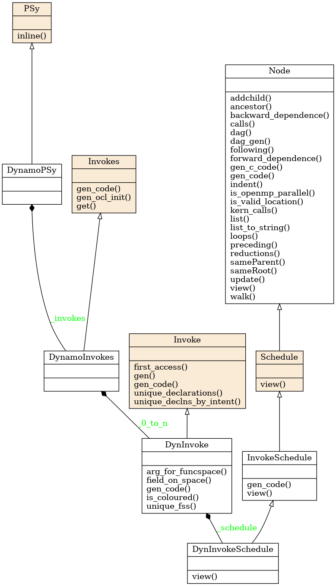
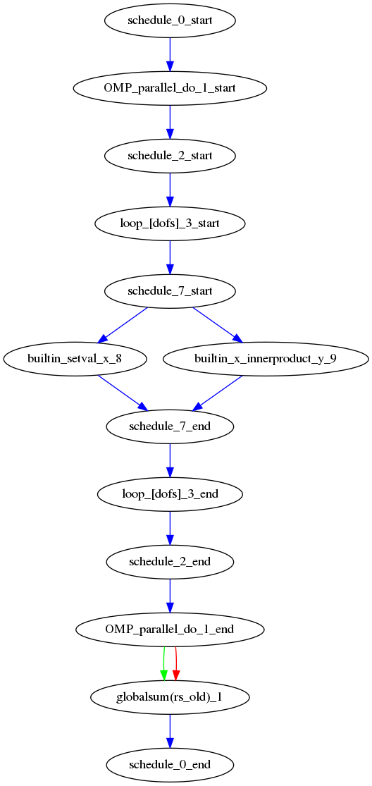

.. _PSy-layer:

PSy layer
=========

In the PSyKAl separation of concerns, the PSy layer is responsible for
linking together the Algorithm and Kernel layers and for providing the
implementation of any Built-in operations used. Its
functional responsibilities are to

1. map the arguments supplied by an Algorithm ``invoke`` call to the arguments required by a Built-in or Kernel call (as these will not have a one-to-one correspondance).
2. call any Kernel routines such that they cover the required iteration space and
3. perform any Built-in operations (either by including the necessary code
   directly in the PSy layer or by e.g. calling a maths library) and
4. include any required distributed memory operations such as halo swaps and reductions.

Its other role is to allow the optimisation expert to optimise any
required distributed memory operations, include and optimise any
shared memory parallelism and optimise for single node (e.g. cache and
vectorisation) performance.

Code Generation
---------------

The PSy layer can be written manually but this is error prone and
potentially complex to optimise. The PSyclone code generation system
generates the PSy layer so there is no need to write the code
manually.

To generate correct PSy layer code, PSyclone needs to understand the
arguments and datatypes passed by the algorithm layer and the
arguments and datatypes expected by the Kernel layer; it needs to know
the name of the Kernel subroutine(s); it needs to know the iteration
space that the Kernel(s) is/are written to iterate over; it also needs
to know the ordering of Kernels and Built-ins as specified in the algorithm
layer. Finally, it needs to know where to place any distributed memory
operations.

PSyclone determines the above information by being told the API in
question (by the user), by reading the appropriate Kernel and Built-in
metadata and by reading the order of Kernels and Built-ins in an
invoke call (as specified in the algorithm layer).

PSyclone has an API-specific parsing stage which reads the algorithm
layer and all associated Kernel metadata. This information is passed
to a PSy-generation stage which creates a high level view of the PSy
layer. From this high level view the PSy-generation stage can generate
the required PSy code.

For example, the following Python code shows a code being parsed, a
PSy-generation object being created using the output from the parser
and the PSy layer code being generated by the PSy-generation object.
::

    from psyclone.parse.algorithm import parse
    from psyclone.psyGen import PSyFactory
    
    # This example uses version 0.1 of the Dynamo API
    api = "dynamo0.1"
    
    # Parse the file containing the algorithm specification and
    # return the Abstract Syntax Tree and invokeInfo objects
    ast, invokeInfo = parse("dynamo.F90", api=api)
    
    # Create the PSy-layer object using the invokeInfo
    psy = PSyFactory(api).create(invokeInfo)
    # Generate the Fortran code for the PSy layer
    print psy.gen

API
---

The PSy-layer of a single algorithm file is represented by the **PSy** class.
The PSy class has an **Invokes** object which contain one or more
**Invoke** instances (one for each invoke in the algorithm layer).
Each **Invoke** has an **InvokeSchedule** object with the PSyIR tree
that describes the PSy layer invoke subroutine.
This subroutine is called by the Algorithm layer and itself calls one or
more kernels and/or implements any required Built-in operations.

All this classes can be specialised in each PSyclone API to support the
specific features of the APIs. The class diagram for the above base classes
is shown below using the dynamo0.3 API as an illustration. This class diagram
was generated from the source code with pyreverse and edited with inkscape.

The InvokeSchedule can currently contain nodes of type: **Loop**,
**Kernel**, **Built-in** (see the :ref:`built-ins` section),
**Directive** (of various types), **HaloExchange**, or
**GlobalSum** (the latter two are only used if distributed memory is
supported and is switched on; see the :ref:`distributed_memory`
section). The order of the tree (depth first) indicates the order of
the associated Fortran code.

PSyclone will initially create a "vanilla" (functionally correct but
not optimised) InvokeSchedule.  This "vanilla" InvokeSchedule can be
modified by changing the objects within it. For example, the order that
two Kernel calls appear in the generated code can be changed by changing
their order in the tree. The ability to modify this high level view of a
InvokeSchedule allows the PSy layer to be optimised for a particular
architecture (by applying optimisations such as blocking, loop
merging, inlining, OpenMP parallelisation etc.). The tree could be
manipulated directly, however, to simplify optimisation, a set of
transformations are supplied. These transformations are discussed in
the next section.

InvokeSchedule visualisation
++++++++++++++++++++++++++++

PSyclone supports visualising an InvokeSchedule (or any other PSyIR node)
in two ways. Firstly the `view()` method outputs textual information about
the contents of a PSyIR node. If we were to look at the dynamo eg6 example
we would see the following output:
::

   >>> schedule.view()
   InvokeSchedule[invoke='invoke_0', dm=True]
       Directive[OMP parallel do]
           Loop[type='dofs',field_space='any_space_1',it_space='dofs']
               BuiltIn setval_X_code(p,z)
               BuiltIn X_innerproduct_Y_code(rs_old,res,z)
       GlobalSum[scalar='rs_old']

The above output tells us that the invoke name for the InvokeSchedule we are
looking at is `invoke_0` and that the distributed_memory option has
been switched on. Within the InvokeSchedule is an OpenMP parallel directive
containing a loop which itself contains two builtin calls. As the
latter of the two builtin calls requires a reduction and distributed
memory is switched on, PSyclone has added a GlobalSum call for the
appropriate scalar.

Secondly, the `dag()` method (standing for directed acyclic graph),
outputs the PSyIR nodes and its data dependencies. By default a file in
dot format is output with the name ``dag`` and a file in svg format is
output with the name ``dag.svg``. The file name can be changed using
the ``file_name`` optional argument and the output file format can be
changed using the ``file_format`` optional argument. The file_format
value is simply passed on to graphviz so the graphviz documentation
should be consulted for valid formats if svg is not required.
::

   >>> schedule.dag(file_name="lovely", file_format="png")

.. note:: The dag method can be called from any node and will
          output the dag for that node and all of its children.

If we were to look at the dynamo eg6 example we would see the
following image:

In the image, all PSyIR nodes with children are split into a start
vertex and an end vertex (for example the InvokeSchedule node has
both `schedule_start` and `schedule_end` vertices).
Blue arrows indicate that there is a parent to child relationship (from
a start node) or a child to parent relationship (to an end node).
Green arrows indicate that a Node depends on another Node later in the
schedule (which we call a forward dependence). Therefore the OMP parallel
loop must complete before the globalsum is performed.
Red arrows indicate that a Node depends on
another Node that is earlier in the schedule (which we call a backward
dependence). However the direction of the red arrows are reversed to
improve the flow of the dag layout. In this example the forward and
backward dependence is the same, however this is not always the
case. The two built-ins do not depend on each other, so they have no
associated green or red arrows.

The dependence graph output gives an indication of whether nodes can
be moved within the InvokeSchedule. In this case it is valid to run the
builtin's in either order. The underlying dependence analysis used to
create this graph is used to determine whether a transformation of a
Schedule is valid from the perspective of data dependencies.
