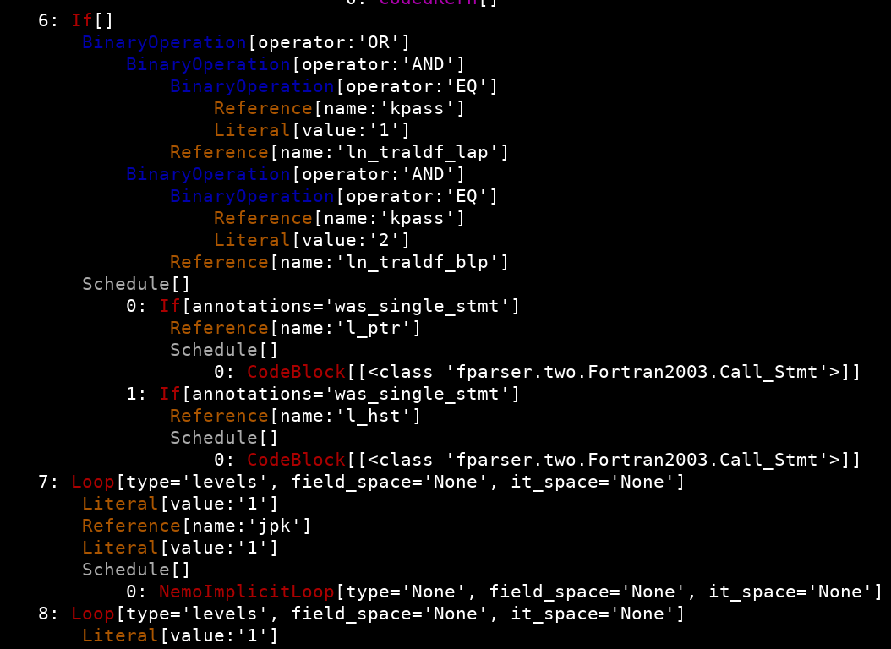

.. -----------------------------------------------------------------------------
.. BSD 3-Clause License
..
.. Copyright (c) 2019, Science and Technology Facilities Council.
.. All rights reserved.
..
.. Redistribution and use in source and binary forms, with or without
.. modification, are permitted provided that the following conditions are met:
..
.. * Redistributions of source code must retain the above copyright notice, this
..   list of conditions and the following disclaimer.
..
.. * Redistributions in binary form must reproduce the above copyright notice,
..   this list of conditions and the following disclaimer in the documentation
..   and/or other materials provided with the distribution.
..
.. * Neither the name of the copyright holder nor the names of its
..   contributors may be used to endorse or promote products derived from
..   this software without specific prior written permission.
..
.. THIS SOFTWARE IS PROVIDED BY THE COPYRIGHT HOLDERS AND CONTRIBUTORS
.. "AS IS" AND ANY EXPRESS OR IMPLIED WARRANTIES, INCLUDING, BUT NOT
.. LIMITED TO, THE IMPLIED WARRANTIES OF MERCHANTABILITY AND FITNESS
.. FOR A PARTICULAR PURPOSE ARE DISCLAIMED. IN NO EVENT SHALL THE
.. COPYRIGHT HOLDER OR CONTRIBUTORS BE LIABLE FOR ANY DIRECT, INDIRECT,
.. INCIDENTAL, SPECIAL, EXEMPLARY, OR CONSEQUENTIAL DAMAGES (INCLUDING,
.. BUT NOT LIMITED TO, PROCUREMENT OF SUBSTITUTE GOODS OR SERVICES;
.. LOSS OF USE, DATA, OR PROFITS; OR BUSINESS INTERRUPTION) HOWEVER
.. CAUSED AND ON ANY THEORY OF LIABILITY, WHETHER IN CONTRACT, STRICT
.. LIABILITY, OR TORT (INCLUDING NEGLIGENCE OR OTHERWISE) ARISING IN
.. ANY WAY OUT OF THE USE OF THIS SOFTWARE, EVEN IF ADVISED OF THE
.. POSSIBILITY OF SUCH DAMAGE.
.. -----------------------------------------------------------------------------
.. Written by A. R. Porter, STFC Daresbury Lab
      
.. _psyir-ug:

The PSyclone Internal Representation (PSyIR)
============================================

The PSyIR is at the heart of PSyclone, representing code (at both the
PSy- and kernel-layer levels) in a language-agnostic form. A PSyIR may
be constructed from scratch (in Python) or by processing exising
source code using a frontend. Transformations act on the PSyIR and
ultimately the generated code is produced by one of the PSyIR's
backends.

Text Representation
-------------------

When developing a transformation script it is often necessary to examine
the structure of the PSyIR. All nodes in the PSyIR have the ``view`` method
that writes a text-representation of that node and all of its
descendants to stdout. If the ``termcolor`` package is installed
(see :ref:`getting-going`) then colour highlighting is used for this
output. For instance, part of the Schedule constructed for the second NEMO
`example <https://github.com/stfc/PSyclone/blob/master/examples/nemo/eg2/
runme_openmp.py>`_ is rendered as:

Note that in this view, only those nodes which are children of
Schdules have their indices shown. This means that nodes representing
e.g. loop bounds or the conditional part of ``if`` statements are not
indexed. For the example shown, the PSyIR node representing the
``if(l_hst)`` code would be reached by
``schedule.children[6].if_body.children[1]`` or, using the shorthand
notation (see below), ``schedule[6].if_body[1]`` where ``schedule`` is
the overall parent Schedule node (omitted from the above image).

Tree Navigation
---------------

Each PSyIR node provides several ways to navigate the AST:

The `children` and `parent` properties (available in all nodes) provide an
homogeneous method to go up and down the tree hierarchy. This method
is recommended when applying general operations or analysis to the tree,
however, if one intends to navigate the tree in a way that depends on the type
of node, the `children` and `parent` methods should be avoided. The structure
of the tree may change in different versions of PSyclone and the encoded
navigation won't be future-proof.

To solve this issue some Nodes also provide methods for semantic navigation:

- ``Schedule``:
   subscript operator for indexing the statements (children) inside the
   Schedule, e.g. ``sched[3]`` or ``sched[2:4]``.
- ``Assignment``:
   .. automethod:: psyclone.psyGen.Assignment.lhs()
   .. automethod:: psyclone.psyGen.Assignment.rhs()
- ``IfBlock``:
   .. automethod:: psyclone.psyGen.IfBlock.condition()
		
   .. automethod:: psyclone.psyGen.IfBlock.if_body()

   .. automethod:: psyclone.psyGen.IfBlock.else_body()
- ``Directive``:
   .. automethod:: psyclone.psyGen.Directive.dir_body()

These are the recommended methods to navigate the tree for analysis or
operations that depend on the Node type.

Additionally, the `walk` method (available in all nodes) is able to recurse
through the tree and return objects of a given type. This is useful when the
objective is to move down the tree to a specific node or list of nodes without
information about the exact location.

.. automethod:: psyclone.psyGen.Node.walk
