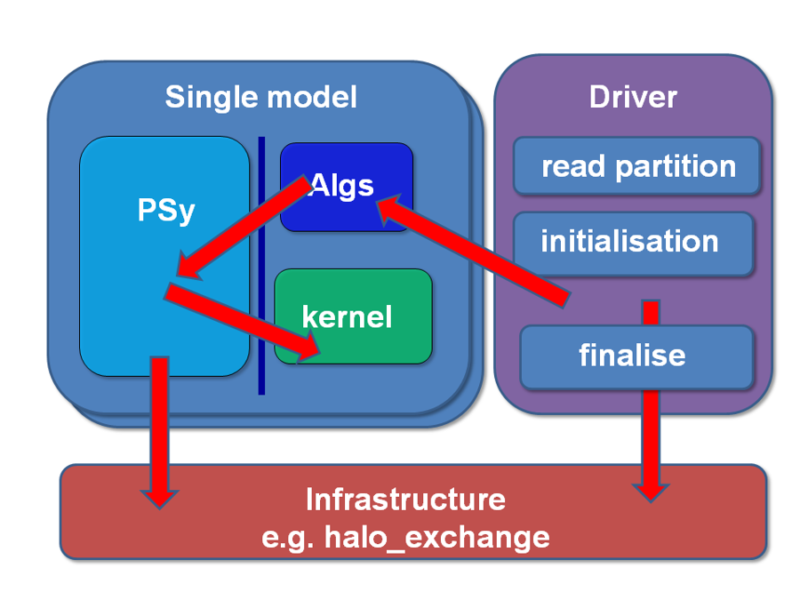

# LFRic: A quick introduction

**LFRic** is the new weather and climate modelling system being developed
by the UK Met Office (UKMO) to replace the existing Unified Model (UM)
in preparation for exascale computing in the 2020s. LFRic uses the GungHo
dynamical core and runs on a semi-structured cubed-sphere mesh.

The design of the supporting infrastructure follows object-oriented
principles to facilitate modularity and the use of external libraries.
One of the guiding design principles, imposed to promote performance
portability, is **separation of concerns** between the science code and
parallel code.

**PSyclone** generates the parallel code for shared and distributed
memory support on CPUs via the LFRic (Dynamo 0.3) API. The generated
code calls the appropriate functionality from the LFRic infrastructure
(e.g. halo exchange, colouring). PSyclone optimisations are routinely
used in building and running LFRic. Together with the developing
support for accelerators, PSyclone aims to facilitate deployment of a
single-source science code onto different machine architectures.

## LFRic repository and wiki

The LFRic repository and the associated wiki are hosted at the Met Office
Science Repository Service [(MOSRS)](https://code.metoffice.gov.uk/trac/home).
The code is BSD-licensed, however browsing the
[LFRic wiki](https://code.metoffice.gov.uk/trac/lfric/wiki) and
[code repository](https://code.metoffice.gov.uk/trac/lfric/browser) requires
login access to MOSRS. Please contact the LFRic team manager,
[Steve Mullerworth](mailto:steve.mullerworth@metoffice.gov.uk), to be granted
access to the repository.

Another useful contact for LFRic-related questions is the
["lfric" mailing list](mailto:lfric@cmpd1.metoffice.gov.uk) which gathers
the Met Office and external LFRic developers and users.

### PSyclone in LFRic

PSyclone LFRic (Dynamo 0.3) API documentation can be found [here](
https://psyclone.readthedocs.io/en/stable/dynamo0p3.html).

LFRic wiki hosts pages on the use of PSyclone in LFRic, starting with the
[PSyclone in LFRic wiki (requires login)](
https://code.metoffice.gov.uk/trac/lfric/wiki/PSycloneTool).

Not every PSyclone release works with every LFRic trunk revision. The LFRic - PSyclone
compatibility table is give in this [LFRic wiki (requires login)](
https://code.metoffice.gov.uk/trac/lfric/wiki/LFRicTechnical/VersionsCompatibility).

## Separation of concerns

The applications in the LFRic tutorial directories build on the principle
of *separation of concerns* between the science code and parallel code.
The source in each is divided into the following layers:

* [**Driver**](LFRic_structure.md#driver-layer) - Set up (e.g. domain,
  partition, science configuration) and control of a model run (e.g.
  timestep loop, checkpoint);
* [**Algorithm**](LFRic_structure.md#algorithm-layer) - Science code
  performing high-level mathematical operations (e.g. solver
  preconditioning) on LFRic field and operator objects;
* [**PSy**](LFRic_structure.md#psy-layer) - Parallel code generated
  by PSyclone;
* [**Kernel**](LFRic_structure.md#kernel-layer) - Science code
  performing low-level mathematical operations (e.g. matrix assembly,
  calculating gradient) for a single column of cells or a single data
  point (degree of freedom or hereafter DoF) on the data held in LFRic
  field and operator objects.

The separation of concerns described above is called **PSyKAl**, from
*Parallel System* (computational science applying optimisations),
*Kernel*(natural science performing operations on data points) and
*Algorithm* (natural science performing operations on whole fields).

All of this is supported by the **LFRic infrastructure**, a collection
of **classes** that encapsulate data and functionality representing the
main model structures such as mesh, partition, finite-element function
spaces, fields, operators, etc. The schematic of the overall PSyKAl
structure is shown in the figure below (courtesy of the UKMO LFRic team).

## References

* Adams SV, Ford RW, Hambley M, Hobson JM, Kavcic I, Maynard CM, Melvin T,
  Mueller EH, Mullerworth S, Porter AR, Rezny M, Shipway BJ and Wong R (2019):
  [LFRic: Meeting the challenges of scalability and performance portability
  in Weather and Climate models.](
  https://doi.org/10.1016/j.jpdc.2019.02.007) Journal of Parallel and
  Distributed Computing.
* [Met Office research news, May 2019](
  https://www.metoffice.gov.uk/research/news/2019/gungho-and-lfric)
