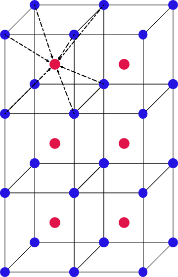

# Simple LFRic Kernel and Scripts

In this session you will implement/complete a simple LFRic kernel,
and add a script to add OpenMP parallelisation. The program creates
two fields on a 3x3 mesh with 5 layers, mostly by using
the testing functionality included in the LFRic infrastructure
(the diagrams show only a 2x1x4 mesh).
It uses the simplified infrastructure files used in PSyclone testing,
and as such can be compiled and run without the need to install LFRic.

We define two fields, one on the W0 space (blue dots) which is initialised with 1,
the other will contain the results and it is on the W3 space, and it is initialised
with 0.

The kernel `summation_w0_to_w3_kernel` is called, which adds up the 8 neighbouring
vertices of field (resulting in 8 on the W3 field). The summation
for the top left element is indicated in the image with dashed lines:

## Initialising LFRic

The full initialisation of LFRic is reasonable complex, we use a simplified
approach here by relying on testing functionality provided by some objects
to create our mesh. We start with creating the 2D, 3x3 mesh (which is what
the default constructor does for testing):

    global_mesh = global_mesh_base_type()

After that we create a partition, which is a simple 1 process setup. The call

    extrusion = uniform_extrusion_type(0.0_r_def, 100.0_r_def, 5)

creates level information - in this case we create 5 levels, with an atmosphere
bottom of 0, and top of 100. The extrusion is then combined with
the 2D global mesh to create our 3x3x5 grid:

    extrusion_ptr => extrusion
    mesh = mesh_type(global_mesh_ptr, partition, extrusion_ptr)

Then we declare two vector spaces on our mesh, one on W3 and one on W1:

    vector_space_0 = function_space_type( mesh, element_order, W0, ndata_sz)
    vector_space_3 = function_space_type( mesh, element_order, W3, ndata_sz)

The input value element order is defined to be 0, meaning our finite elements
only store a single value (a constant function).

We then define two fields, one for each of the two vector spaces:

    call field_0%initialise( vector_space = vector_space_ptr_0, name="field_0" )
    call field_3%initialise( vector_space = vector_space_ptr_3, name="field_3" )

The field `field_0`
is on the vertices of the finite element (W0 function space, blue in the diagram
above). The field `field_3` is on the W3 function space (red in the diagram).

Then we initialise the fields with 0 and 1 respectively, which is done using
a PSyclone builtin for LFRic:

    call invoke( name = 'Initialise_fields',         &
                 setval_c( field_3,     0.0_r_def ), &
                 setval_c( field_0,     1.0_r_def )  &
                 )

We add one invoke, and call the `setval_c` (set constant) kernel for the two
fields individually. After that, we use invoke to call the summation kernel:

    call invoke( name = 'summation', summation_w0_to_w3_kernel_type(field_3, field_0) )

There is no need to use two invokes, it was only done to show how PSyclone
will create one module with two PSy-layer subroutines.

## Hands-on
First of all, the kernel needs to be completed. All the meta-data, subroutine declaration
and even loops are already there, but you still need to add the computation. Once this is
done, you can run `make compile` to compile and link your example and execute it. The
output should be:

    Mesh has           5 layers.
    20240917233109.668+1000:INFO : Min/max minmax of field_3 =   0.80000000E+01  0.80000000E+01

Now finish `openmp.py` to add OpenMP parallelisation. 
