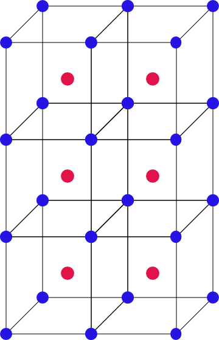

# Simple LFRic Kernel and Scripts

In this session you will add openmp parallelisation for an LFRic kernel
that updates shared values, which will require colouring.

In this example a kernel adds a field on the W0
space (vertices) to another field on the W0 space, i.e. it is adding the blue dots
in the diagram above for two fields. The difference to the kernel used previously
is that the vertices (blue dots) are shared between neighbouring columns, which is
not the case for a field on the W3 space. Therefore, the loop over all columns
cannot be parallelised, since the shared vertices could be read and written by
different threads at the same time.

Running PSyclone with the OpenMP transformation script:

    psyclone -api lfric -s ./omp_transformation.py -dm -l output \
         -opsy main_alg_psy.f90 -oalg main_alg.f90 main_alg.x90
 
(or run `make transform`) will raise an exception:

    Transformation Error: Error in DynamoOMPParallelLoopTrans transformation. \
    The kernel has an argument with INC access. Colouring is required.

## Hands-on

Finish the ``omp_colour_transformation.py`` script to first apply colouring
where required. Then apply OpenMP to all loops, but in case that a loop is
coloured, the OMP directive must be applied to the first child.

The code create should now look like this:
    DO colour = loop2_start, loop2_stop, 1
       !$omp parallel do default(shared), private(cell),
                         schedule(static)
       DO cell = loop3_start, last_edge_cell_all_  &
                 colours(colour), 1
          CALL summation_w0_to_w0_code(nlayers_field_3,
               field_3_data, field_0_data, ndf_w0, undf_w0,
               map_w0(:,cmap(colour,cell)))
       END DO
       !$omp end parallel do
    END DO
