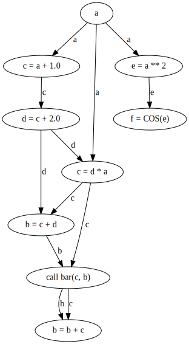

# Using PSyclone in Python Programs and Tools

This hands-on session uses just two stand-alone Python programs,
and is not using the Game of Life at all. These Python programs contain
simple Fortran programs, assigned to a string variable.

## Read and write Fortran source code

Start with using ``handle_fortran.py``. Add the code that converts
Fortran source code to PSyir, and then convert the PSyIR back to
a string.

## Collecting Variable Access Information

This exercise shows the usage of the ``VariableAccessInformation`` class. Use
the program ``var_access.py``, and fill in the code to collect access information
for the whole PSyIR. It already contains code to print out the accesses for
all variables. Example output:

	Variable Access Info - Summary:
	a: READ, b: WRITE+READWRITE+READ, bar: CALL, c: WRITE+READ+READWRITE, d: WRITE+READ, e: WRITE+READ, f: WRITE
	===============================

	a : a:[READ,READ,READ]
	----------------------------
	Type: READ - node Reference[name:'a']
	Type: READ - node Reference[name:'a']
	Type: READ - node Reference[name:'a']

	...

	c : c:[WRITE,READ,WRITE,READ,READWRITE,READ]
	----------------------------
	Type: WRITE - node Reference[name:'c']
	Type: READ - node Reference[name:'c']
	Type: WRITE - node Reference[name:'c']
	Type: READ - node Reference[name:'c']
	Type: READWRITE - node Reference[name:'c']
	Type: READ - node Reference[name:'c']

The node, which is stored for each access,
is typically a ``Reference``. You can use the ``ancestor`` method to find the
statement where the variable is actually used in.

You will find all variable accesses in this list. In the case of a call, the
variables are marked as read and write, since PSyclone does not have any
information about the subroutine (without doing additional work).

The solution directory contains a program ``dataflow.py``, which uses this
information to create graphviz code to show a dataflow diagram. It is
a small wrapper around the `VariableAccessInformation` class, and uses
PSyclone's `DefinitionUseChain` to find all previous write accesses to
a `Reference`.

Given the example code:

	subroutine foo(a, b)
	real, intent(inout) :: a
	real, intent(inout) :: b
	real :: c, d, e, f
	c = a + 1.0
	e = a**2
	f = cos(e)
	d = c + 2.0
	c = d * a
	b = c + d
	call bar(c, b)
	b = b + c
	end subroutine foo

it will create the following graph:

## Using SymPy

The last example uses the program ``sympy_test.py``. It allows you
to convert a Fortran expression to a SymPy expression, which can be
e.g. modified, or used to compute a derivative, and then re-inserted
into the Fortran code. This example shows how to add new nodes,
including comments.

The example code contains the two assignments:

    b = a(j + 2*i - j - i, j*3 - 2*j)*a(i,j)  + 5*b - b - 3*b - 3.14_8
    b = 3*x*x - 2*x - 1

The example program will explicitly simplify the fist assignment. Then it
will take the right-hand-side of the second assignment (``3*x*x - 2*x - 1``),
compute its derivative, and insert it as an additional assignment to the end:

    b = b + a(i,j) ** 2 - 3.14
    b = 3 * x * x - 2 * x - 1
    ! The derivative is:
    b = 6 * x - 2
