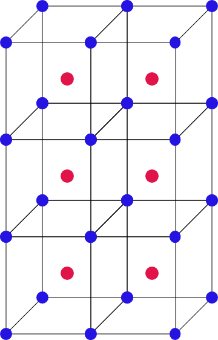

# Simple PSyclone Application

This directory contains a very trivial example code that is based on
the LFRic infrastructure and PSyclone. It uses the simplified infrastructure
files used in PSyclone testing, and as such can be compiled and run without
the need to install LFRic.

There is no need to fully understand the program, but as a quick explanation:
the program creates two fields on a 3x3 mesh with 5 layers. The field `field_0`
is on the vertices of the finite element (W0 function space, blue in the diagram
below), and is initialised with 1. The field `field_3` is on the W3 function
space (red in the diagram) and represents the actual element, it is initialised
with 0.

Then the kernel `summation_w0_to_w3_kernel` is called, which adds the 8 neighbouring
vertices of an element up (resulting in 8 for all the finite elements). The summation
for the top left element is indicated in the image with dashed lines:

Each of the following examples has its own subdirectories with the required files.
In order to run the tests, change into the subdirectory specified in the heading.
The required PSyclone command is specified in this document, but in all cases
you can also just run `make` in order to run PSyclone with the required parameters.

## Using PSyclone (`1_using_psylone`)
In this example we use PSyclone to process the algorithm file and create the new
algorithm layer and PSY-layer file.

To create the required PSy-layer, use the following command:

    psyclone -nodm -l output -opsy main_alg_psy.f90 -oalg main_alg.f90 main_alg.x90

The same command can be triggered by `make`. This will create
two new output files, `main_alg.f90`, the rewritten algorithm layer `main_alg.x90`,
and `main_alg_psy.f90`, the created PSy-layer.

Look at the two created  files. You don't need to try to understand the details, since
PSyclone is creating quite a bit of code. Identify how the main program, the algorithm
layer, calls the PSylayer, and how the PSy-layer calls the kernel in a loop. Focus
on the first two invokes in `main_alg.x90`:

    call invoke( name = 'Initialise fields',         &
                 setval_c( field_3,     0.0_r_def ), &
                 setval_c( field_0,     1.0_r_def )  &
                 )
    call invoke( name = 'summation', summation_w0_to_w3_kernel_type(field_3, field_0) )

How are these lines rewritten in the algorithm file `main_alg.f90`? Then check the
PSy-layer file `main_alg_psy.f90` to find the two subroutines called from the
algorithm file. Can you find the builtins in the PSy-layer file `main_alg_psy.f90`? And
check the loop over all columns that will then  call `summation_w0_to_w3_kernel_code` for
each column.

You can even compile and execute the script: `make compile` will create a binary for
you (including compilation of the required LFRic infrastructure, which can take some
time). Executing the binary with `./example` will print:

     Mesh has           5 layers.
    20230905101141.609+1000:INFO : Min/max minmax of field_3 =   0.80000000E+01  0.80000000E+01

The minimum and maximum of `field1` are printed, and they are as expected 8.

The solution and explanation can be found [here](#solution-for-using-psyclone).

## Supporting MPI (`2_supporting_mpi`)
As explained, PSyclone has the ability to support MPI parallelisation of the code. This
is simply done by using the command line option `-dm` (instead of `-nodm`):

    psyclone -dm -l output -opsy main_psy.f90 -oalg main_alg.f90 main_alg.x90

Use this option, and look at the PSy-layer. Some of the setup code
has changed (which is related to getting the loop sizes based on a distributed field),
and additionally there is now code that marks if the value of an array has changed,
called `dirty`. This indicates that the neighbouring processes might not have the correct
values, and these needs to be updated before they are used. The `set_dirty` calls
themselves do not trigger any communication. This is only done when the modified values
are actually used. In this example this happens in the user supplied kernel, which reads
the data of `field_w0`. Look for the code that will trigger an update of the values of
`field_w0`.

A small caveat: while this program could now be started with `mpirun`, there is
no domain-decomposition done! So each copy would run the same code (each one
computing the full field), since the fields are not distributed. This requires
additional setup, which is beyond the scope of this tutorial.

The solution and explanation can be found [here](#solution-for-supporting-mpi).

## Applying OpenMP (`3_applying_openmp`)
In this example you will add transformation script to the PSyclone command line.
This script will apply OpenMP transformation to the loops. Add the option
`-s omp.py` to the PSyclone command, i.e.:

    psyclone -s ./omp_transformation.py -nodm -l output -opsy main_alg_psy.f90 -oalg main_alg.f90 main_alg.x90

The script will combine the two loops for the two `setval_c`
calls into a single loop, and then apply OpenMP parallelisation to all loops.
Compare the PSy-layer files with the previously created files. What has changed?

The solution and explanation can be found [here](#solution-for-applying-openmp).

## MPI and OpenMP (`4_mpi_and_openmp`)
This is an optional task and you can skip it if you are in a rush.

Especially for large models you would want to utilise hybrid parallelism, i.e. using
MPI and OpenMP at the same time. In this example we will enable both kind of
parallelisation at the same time. In order to do this, you need to invoke PSyclone
with the `-dm` flag, but also apply the OpenMP transformation:

    psyclone -s ./omp_transformation.py -dm -l output -opsy main_al_psy.f90 -oalg main_alg.f90 main_alg.x90

Again, check the created PSy-layer file `main_alg_psy.f90` for the calls to halo-exchanges
and OpenMP directives around loops.

The solution and explanation can be found [here](#solution-for-mpi-and-openmp).

## Error in Algorithm Layer (`5_alg_layer_error`)
Now let's have a look at some typical errors. Ideally they should not happen
for a user of a stable LFRic release, but if you for example should select
an untested set of options some of these problems could still happen. The
first example `main_alg.x90` contains an invalid PSyclone builtin name,
though of course PSyclone cannot know what exactly the user meant.
Use:

    psyclone -nodm -l output -opsy main_alg_psy.f90 -oalg main_alg.f90 main_alg.x90

Does PSyclone's error message make sense?

The solution and explanation can be found [here](#solution-for-error-in-algorithm-layer).

## Missing Parameter (`6_missing_parameter`)
This example misses a kernel parameter. Run PSyclone, i.e.:

    psyclone -nodm -l output -opsy main_alg_psy.f90 -oalg main_alg.f90 main_alg.x90

What happens?

The solution and explanation can be found [here](#solution-for-missing-parameter).

## Invalid OpenMP Transformation (`7_invalid_openmp`)
This example has a slightly different kernel: this kernel adds a field on the W0
space (vertices) to another field on the W0 space, i.e. it is adding the blue dots
in the diagram above for two fields. The difference to the kernel used previously
is that the vertices (blue dots) are shared between neighbouring columns, which is
not the case for a field on the W3 space. Therefore, the loop over all columns
cannot be parallelised, since the shared vertices could be read and written by
different threads at the same time.

Running PSyclone with the OpenMP transformation script:

    psyclone -s ./omp_transformation.py -dm -l output -opsy main_alg_psy.f90 -oalg main_alg.f90 main_alg.x90

What is PSyclone's behaviour? Note that LFRic provides a more
sophisticated version of the `omp_transformation.py` script, which will change the single
loop into a nested loop using a transformation called colouring. This in turn
then allows PSyclone to apply OpenMP parallelisation. PSyclone will always
internally verify if it is safe to apply a certain transformation, to make
sure it does not create incorrect code.

The solution and explanation can be found [here](#solution-for-invalid-transformation).

## Incorrect Naming Scheme (`8_incorrect_naming`)
This example shows the importance of naming the files correctly. It is basically the same code
as in the very first PSyclone example, but the kernel file has been renamed to
`summation_w0_to_w3_mod.f90`, but the module name is still summation_w0_to_w3_kernel_mod and
the `use` statement in the algorithm layer is unchanged as well:

    use summation_w0_to_w3_kernel_mod, only: summation_w0_to_w3_kernel_type

This works with a compiler (assuming that the kernel is compiled before the algorithm
file), since the compiler will create a compiler-specific file
`summation_w0_to_w3_kernel_mod`, which stores the required information about this
module. PSyclone does not have this information, and as such rely on the naming scheme
for finding the source files for modules. Therefore, PSyclone cannot find the source
file for the kernel, and since the data in this kernel specify which kind of loop
to create, it cannot process the algorithm layer.

Run PSyclone with the standard command:

    psyclone -s ./omp_transformation.py -dm -l output -opsy main_alg_psy.f90 -oalg main_alg.f90 main_alg.x90

and look at the error message provided by PSyclone.

The solution and explanation can be found [here](#solution-for-invalid-transformation).

# Solutions
This section contains the solutions and explanations for all hands-on tasks.

## Solution for Using PSyclone
The file `main_alg.f90` contains two calls to a PSy layer:
    CALL invoke_initialise_fields(field_3, field_0)
    CALL invoke_summation(field_3, field_0)
    
In turn the `main_alg_psy.f90` files contains these two subroutines. The first
one contains the implementation of the builtins, i.e. the code is inlined:

    !
    ! Call our kernels
    !
    DO df=loop0_start,loop0_stop
      field_3_proxy%data(df) = 0.0_r_def
    END DO
    DO df=loop1_start,loop1_stop
      field_0_proxy%data(df) = 1.0_r_def
    END DO

The second subroutine contains the call of the test kernel:

    !
    ! Call our kernels
    !
    DO cell=loop0_start,loop0_stop
       !
       CALL summation_w0_to_w3_kernel_code(nlayers, field_3_proxy%data, field_0_proxy%data, &
                                           ndf_w3, undf_w3, map_w3(:,cell), ndf_w0, undf_w0, map_w0(:,cell))
    END DO

Note that PSyclone will automatically provide additional required parameters to
the kernel.

## Solution for Supporting MPI
After initialising a field, it is marked to be modified (or 'dirty'):

    DO df=loop0_start,loop0_stop
        field_3_proxy%data(df) = 0.0_r_def
    END DO
    !
    ! Set halos dirty/clean for fields modified in the above loop
    !
    CALL field_3_proxy%set_dirty()

Next time the fields are read, we need to get the newly computed values which
might be on neighbouring processes. So the second subroutine in the PSy-layer
contains:

    IF (field_0_proxy%is_dirty(depth=1)) THEN
       CALL field_0_proxy%halo_exchange(depth=1)
    END IF
    !
    DO cell=loop0_start,loop0_stop
       !
       CALL summation_w0_to_w3_kernel_code(nlayers, field_3_proxy%data, field_0_proxy%data, &
                                           ndf_w3, undf_w3, map_w3(:,cell), ndf_w0, undf_w0, map_w0(:,cell))
    END DO
    !
    ! Set halos dirty/clean for fields modified in the above loop
    !
    CALL field_3_proxy%set_dirty()

The halo-exchange uses an if-statement so that the communication functions are
only called if the values of a field have actually changed. While in our case this is
always be the case, in a more complex program it happens frequently that a field
has not been updated since the last time the halo-values were exchanged. So this
is an automatically applied optimisation that can significantly reduce the number of MPI
calls required.

## Solution for Applying OpenMP
You will see `omp parallel do` statements around each individual loop:

    !$omp parallel do default(shared), private(df), schedule(static)
    DO df=loop0_start,loop0_stop
      field_3_proxy%data(df) = 0.0_r_def
    END DO
    !$omp end parallel do
    !$omp parallel do default(shared), private(df), schedule(static)
    DO df=loop1_start,loop1_stop
      field_0_proxy%data(df) = 1.0_r_def
    END DO
    !$omp end parallel do

While this example works, it is obviously very inefficient: the two loops should be
in one `omp parallel` region, to avoid the overhead of stopping and starting the
threads. This can be done in PSyclone, but would require a slightly more complicated
script.

For the user kernel you will see:

    !$omp parallel do default(shared), private(cell), schedule(static)
    DO cell=loop0_start,loop0_stop
       !
       CALL summation_w0_to_w3_kernel_code(nlayers, field_3_proxy%data, field_0_proxy%data, &
                                           ndf_w3, undf_w3, map_w3(:,cell), &ndf_w0, undf_w0, map_w0(:,cell))
    END DO
    !$omp end parallel do

## Solution for MPI and OpenMP
Implementing hybrid parallelism is easy once a script was written to add the required OpenMP statements.
The output file contains first the halo exchange, followed by the loop with OpenMP directives:

    IF (field_0_proxy%is_dirty(depth=1)) THEN
       CALL field_0_proxy%halo_exchange(depth=1)
    END IF
    !
    !$omp parallel do default(shared), private(cell), schedule(static)
    DO cell=loop0_start,loop0_stop
       !
       CALL summation_w0_to_w3_kernel_code(nlayers, field_3_proxy%data, field_0_proxy%data, &
                                           ndf_w3, undf_w3, map_w3(:,cell), ndf_w0, undf_w0, map_w0(:,cell))
    END DO
    !$omp end parallel do
    !
    ! Set halos dirty/clean for fields modified in the above loop(s)
    !
    CALL field_3_proxy%set_dirty()

 
## Solution for Error in Algorithm Layer

PSylone will print the following error message (or a variation of it, since depending
on version the list of builtins might change):

    Parse Error: kernel call 'no_setval_c' must either be named in a use statement (found
    ['global_mesh_base_mod', 'mesh_mod', 'mesh_mod', 'partition_mod', ..., 'log_mod',
    'summation_w0_to_w3_kernel_mod']) or be a recognised built-in (one of '['x_plus_y',
    'inc_x_plus_y', 'a_plus_x', 'inc_a_plus_x',... , 'real_x']' for this API)

PSyclone cannot know if `no_setval_c` is supposed to be a builtin (for which no `use` statement
would be required), or if it is supposed to be a user-defined kernel (which requires
a `use` statement).

## Solution for Missing Parameter
PSyclone will detect that a parameter is missing for the kernel:

    Parse Error: Kernel 'summation_w0_to_w3_kernel_type' called from the algorithm layer with
    an insufficient number of arguments as specified by the metadata. Expected at least '2'
    but found '1'.

PSyclone will verify the code the user asked to be created as much as possible and raise
any issues early on, i.e. before even compiling the code.

## Solution for Invalid Transformation
PSyclone internally verifies transformation to make sure it will always create valid
code. In this case, it will recognise that the kernel cannot simply be parallelised.
It would need an additional transformation (called colouring) in order to allow
threading-based parallelisation:

    Generation Error: generator: specified PSyclone transformation module 'omp_transformation'
    raised the following exception during execution...
    {
          File ".../7_invalid_openmp/./omp_transformation.py", line 55, in trans
        otrans.apply(loop)
          File ".../psyclone/src/psyclone/transformations.py", line 676, in apply
        raise TransformationError(
        psyclone.psyir.transformations.transformation_error.TransformationError: Transformation Error:
            Error in DynamoOMPParallelLoopTrans transformation. The kernel has an argument with INC
            access.Colouring is required.
    }
    please check your script

This error should be reported to the developers of the optimisation script.
  

## Solution for Incorrect Naming Scheme

PSyclone will print the error message:

    Parse Error: Kernel file 'summation_w0_to_w3_kernel_mod.[fF]90' not found in
    .../training/users/lfric/8_incorrect_naming

Notice that the error message exactly specifies the file name PSyclone is looking for,
and also in which directory it is searching. PSyclone provides the command line
parameter `-d` to specify a directory in which kernels will be searched. In this
case you could add ` -d ../1_using_psyclone` and the kernel would be found in the
first example.
